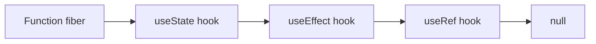
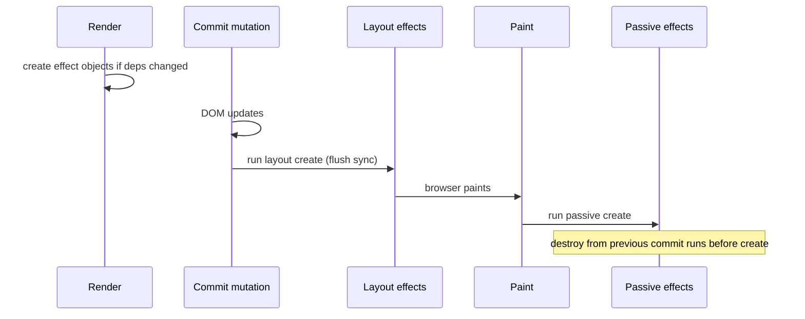

# Hooks Implementation

Hooks are not magic — they’re a **linked list on the fiber**, built during render in call order, read by dispatchers that switch between mount and update. Understanding that list explains rules of hooks, stale closures, and `useEffect` timing.

## Where hooks live

On a function component fiber:

```ts
type Hook = {
  memoizedState: any // state value | effect | ref object | ...
  baseState: any
  baseQueue: Update | null
  queue: UpdateQueue | null // for useState/useReducer
  next: Hook | null
}

// fiber.memoizedState → Hook → Hook → Hook → null
```



During render React holds:

```ts
let currentlyRenderingFiber: Fiber | null = null
let workInProgressHook: Hook | null = null
let currentHook: Hook | null = null // from fiber.alternate
```

Each hook call advances `workInProgressHook = workInProgressHook.next` (update) or appends a new hook (mount).

## Rules of hooks = list shape must be stable

```tsx
// ❌ Conditional hook — list length/order changes between renders
if (cond) useState(0)
useEffect(() => {})

// ✅ Same order every render
const [x, setX] = useState(0)
useEffect(() => {})
```

If call order changes, hook *n* reads the wrong `memoizedState` (state mix-ups, crashes).

## Dispatcher pattern

```ts
const HooksDispatcherOnMount = {
  useState: mountState,
  useEffect: mountEffect,
  useRef: mountRef,
  // ...
}
const HooksDispatcherOnUpdate = {
  useState: updateState,
  useEffect: updateEffect,
  useRef: updateRef,
}

// resolveDispatcher() returns current dispatcher; invalid outside render
```

First render of a fiber → mount dispatcher. Later → update. Strict Mode double-invoke still uses mount semantics carefully for detecting impure renders.

## useState / useReducer internals

### Mount

```ts
function mountState<S>(initial: S | (() => S)): [S, Dispatch<BasicStateAction<S>>] {
  const hook = mountWorkInProgressHook()
  const initialState = typeof initial === 'function' ? (initial as () => S)() : initial
  hook.memoizedState = hook.baseState = initialState
  hook.queue = {
    pending: null,
    lanes: NoLanes,
    dispatch: null as any,
  }
  const dispatch = (hook.queue.dispatch = dispatchSetState.bind(
    null,
    currentlyRenderingFiber!,
    hook.queue,
  ))
  return [hook.memoizedState, dispatch]
}
```

`dispatch` closes over **fiber + queue**, not the render’s state snapshot — that’s why setState works from timeouts.

### Update queue (circular linked list)

```ts
type Update<A> = {
  lane: Lane
  action: A
  next: Update<A> // circular
  // eagerState / hasEagerState for bailout
}

function dispatchSetState(fiber: Fiber, queue: UpdateQueue, action: any) {
  const update: Update = { lane: requestUpdateLane(fiber), action, next: null as any }
  // push onto circular pending queue
  const pending = queue.pending
  if (pending === null) update.next = update
  else {
    update.next = pending.next
    pending.next = update
  }
  queue.pending = update
  scheduleUpdateOnFiber(fiber, update.lane)
}
```

### Processing on next render

```ts
function updateState<S>(): [S, Dispatch<...>] {
  const hook = updateWorkInProgressHook()
  const queue = hook.queue!
  const pending = queue.pending
  let base = hook.baseState
  if (pending !== null) {
    queue.pending = null
    let first = pending.next!
    let update = first
    do {
      // skip updates whose lanes aren't in renderLanes (partial render)
      base = typeof update.action === 'function' ? update.action(base) : update.action
      update = update.next!
    } while (update !== first)
    hook.memoizedState = hook.baseState = base
  }
  return [hook.memoizedState, queue.dispatch!]
}
```

**Functional updates** `setS(s => s + 1)` chain correctly when batched; object replaces don’t merge (unlike class `setState`).

### Eager bailout

If fiber is not rendering and the only update produces the **same** state (`Object.is`), React can skip scheduling — classic `setCount(c => c)` no-op optimization (with caveats around still-running renders).

## useEffect / useLayoutEffect

Effect hooks store a list on the fiber’s update queue / hook `memoizedState`:

```ts
type Effect = {
  tag: HookFlags // Passive | Layout | HasEffect | ...
  create: () => (() => void) | void
  destroy: (() => void) | undefined
  deps: any[] | null
  next: Effect
}
```

| Hook | Phase | Timing |
| --- | --- | --- |
| `useLayoutEffect` | Layout (commit) | After DOM mutations, **before paint** — sync |
| `useEffect` | Passive | After paint — async scheduled |

### Deps comparison

```ts
function areHookInputsEqual(next: any[] | null, prev: any[] | null) {
  if (prev === null || next === null) return false
  for (let i = 0; i < prev.length && i < next.length; i++) {
    if (!Object.is(next[i], prev[i])) return false
  }
  return true
}
```

Empty deps `[]` → mount (+ Strict Mode remount in dev). No deps array → every render.

### Lifecycle



On unmount / dep change: **destroy** (cleanup) then **create**. Strict Mode (React 18+) mounts → unmounts → remounts in development to surface missing cleanups.

## useRef

```ts
function mountRef<T>(initial: T) {
  const hook = mountWorkInProgressHook()
  const ref = { current: initial }
  hook.memoizedState = ref
  return ref
}
// updateRef: return same object — mutating .current does not schedule update
```

## useMemo / useCallback

```ts
function mountMemo(create: () => any, deps: any[] | null) {
  const hook = mountWorkInProgressHook()
  const value = create()
  hook.memoizedState = [value, deps]
  return value
}
function updateMemo(create: () => any, deps: any[] | null) {
  const hook = updateWorkInProgressHook()
  const prev = hook.memoizedState
  if (deps && areHookInputsEqual(deps, prev[1])) return prev[0]
  const next = create()
  hook.memoizedState = [next, deps]
  return next
}
```

`useCallback(fn, deps)` ≡ `useMemo(() => fn, deps)`.

## useContext

Not a list hook in the same way — `readContext` during render records context dependency on the fiber. When Provider’s `memoizedProps.value` changes (by `Object.is`), dependents are scheduled.

```tsx
const ThemeContext = createContext('light')
// Provider fiber pushes context value onto stack during beginWork
// Consumer / useContext reads from stack
```

## Custom hooks

Just functions calling hooks — they share the **caller’s** fiber list. No separate fiber unless you render a child component.

```ts
function useAuth() {
  const [user, setUser] = useState<User | null>(null)
  useEffect(() => {
    const id = subscribe(setUser)
    return () => unsubscribe(id)
  }, [])
  return user
}
```

## Stale closures

```tsx
useEffect(() => {
  const id = setInterval(() => console.log(count), 1000) // stale if count in deps omitted
  return () => clearInterval(id)
}, []) // bug
```

Fixes: include deps, functional updates, refs for latest value, or Event pattern (`useEffectEvent`).

```tsx
const onTick = useEffectEvent(() => {
  console.log(count) // always reads latest without being a dep
})
useEffect(() => {
  const id = setInterval(() => onTick(), 1000)
  return () => clearInterval(id)
}, [])
```

## Interview Q&A

**Q: Why can’t hooks be conditional?**  
A: Hook identity is position in a linked list. Conditional calls shift positions → wrong state.

**Q: How does setState know which component?**  
A: `dispatch` is bound to the fiber and queue from mount; it schedules that fiber’s lanes.

**Q: useEffect vs useLayoutEffect?**  
A: Layout runs before paint (measure DOM, sync prevent flicker). Passive after paint (subscriptions, analytics, non-critical).

**Q: Does useState batch?**  
A: React 18 batches across event handlers, promises, timeouts in most cases (`createRoot`). Still one render for multiple sets in the same event.

**Q: Where is hook state garbage-collected?**  
A: When the fiber unmounts; the list is dropped with the fiber.

**Q: Why Object.is for deps?**  
A: Same algorithm as `===` except `NaN` equals `NaN` and `+0` ≠ `-0`.

**Q: Can you call hooks in class components?**  
A: No — classes don’t use the hook list dispatcher path.

## Common Mistakes

- Missing effect cleanups (leaked listeners, competing intervals) — Strict Mode exposes this.
- Putting objects/arrays inline in deps without memo → effect every render.
- Reading props/state in async effect without abort/`let cancelled` / `AbortController`.
- Assuming `useMemo` is for semantic correctness — it’s a performance hint (React may recompute).
- Calling hooks in loops with variable length.
- Overusing `useLayoutEffect` → blocking paint.

## Trade-offs

| API | Prefer when | Avoid when |
| --- | --- | --- |
| `useState` | Local UI state | Server cache (use RQ / RSC) |
| `useReducer` | Complex transitions | Trivial boolean toggles |
| `useEffect` | Sync with external systems | Deriving state from props (compute in render) |
| `useLayoutEffect` | DOM measurement before paint | Network / subscriptions |
| `useRef` | Mutable box, DOM handles | Anything that should re-render on change |
| `useMemo` | Expensive calc / referential stability | Premature micro-opts |

**Senior takeaway:** Explain hooks as fiber-local linked lists + mount/update dispatchers + update queues with lanes. Effects are commit-time, not render-time.


## useReducer as the foundation

`useState` is a specialized `useReducer`. The update queue algorithm is shared: process pending updates whose lanes are included in `renderLanes`, compute next state, store on hook.

```ts
function reducer(state: State, action: Action): State {
  switch (action.type) {
    case 'add':
      return { ...state, items: [...state.items, action.item] }
    default:
      return state
  }
}

const [state, dispatch] = useReducer(reducer, { items: [] })
```

Prefer `useReducer` when next state depends on complex previous state or when you want an action log mental model (easier to test).

## useId / useSyncExternalStore / useImperativeHandle

```tsx
const id = useId() // stable SSR-safe id for a11y labels

const snapshot = useSyncExternalStore(
  store.subscribe,
  store.getSnapshot,
  store.getServerSnapshot, // SSR/hydration
)

useImperativeHandle(ref, () => ({
  focus: () => inputRef.current?.focus(),
}), [])
```

`useId` generates IDs that match between server and client — don’t replace with `Math.random()`.

## Strict Mode double rendering

In development, React may:

- Double-invoke render (detect impure render)
- Mount → unmount → remount effects (detect missing cleanup)

Production runs once. Interview answer: **dev-only**, not a prod double-fetch guarantee — still make effects idempotent.

## Extra Q&A

**Q: Does useState merge objects like class setState?**  
A: No — replacement. Spread yourself or use reducer.

**Q: Why is mount vs update dispatcher switched?**  
A: Mount allocates hooks; update walks existing list and must not change length/order.


## Implementing a mini `useState` (interview whiteboard)

```ts
type Hook = { state: any; queue: any[]; next: Hook | null }
let first: Hook | null = null
let current: Hook | null = null
let isMount = true

function useState<T>(initial: T): [T, (v: T | ((p: T) => T)) => void] {
  if (isMount) {
    const hook: Hook = { state: initial, queue: [], next: null }
    if (!first) first = hook
    else current!.next = hook
    current = hook
  } else {
    current = current ? current.next : first
  }
  const hook = current!
  hook.queue.forEach((a) => {
    hook.state = typeof a === 'function' ? a(hook.state) : a
  })
  hook.queue = []
  const set = (v: T | ((p: T) => T)) => {
    hook.queue.push(v)
    scheduleRender()
  }
  return [hook.state as T, set]
}

function render(Component: () => any) {
  current = null
  const el = Component()
  isMount = false
  current = null
  return el
}
```

Explain gaps vs real React: lanes, bailout, concurrent skip, eager state, circular queues, Strict Mode.

## Effect event pattern without `useEffectEvent`

```tsx
function useLatest<T>(value: T) {
  const ref = useRef(value)
  useLayoutEffect(() => {
    ref.current = value
  })
  return ref
}

function Search({ query }: { query: string }) {
  const qRef = useLatest(query)
  useEffect(() => {
    const id = setInterval(() => {
      console.log('polling', qRef.current)
    }, 5000)
    return () => clearInterval(id)
  }, []) // stable; reads latest query via ref
}
```
