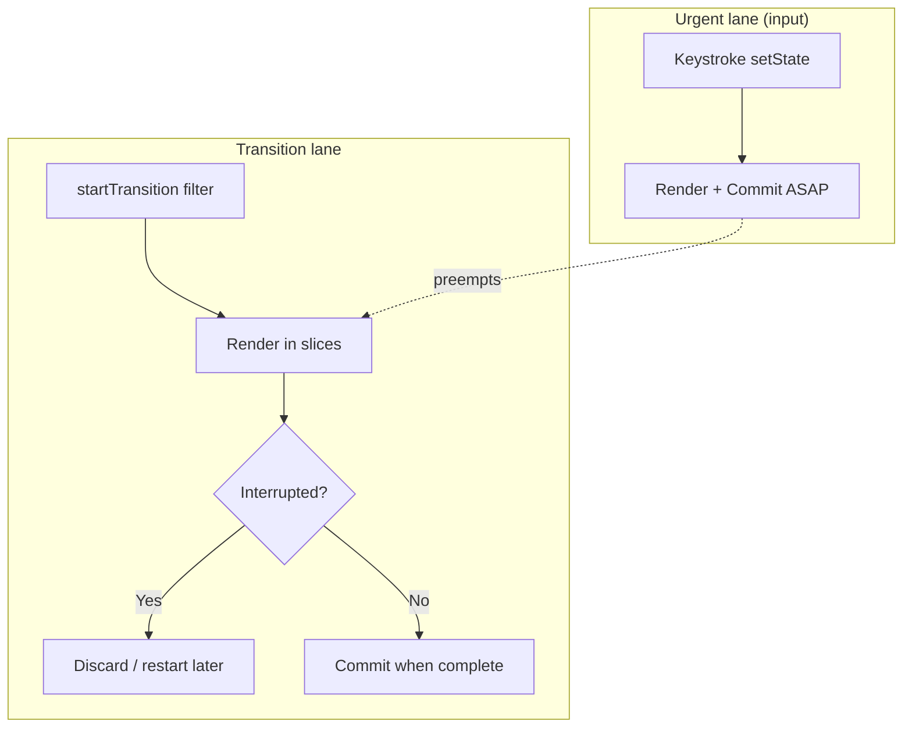

# Concurrent Rendering

Concurrent React (enabled by default with `createRoot` in React 18+) means rendering is **interruptible** and **prioritized**. The UI can stay responsive while React prepares a heavy update in the background, then commit when ready — or discard that work if something more urgent arrives.

## Concurrent ≠ async React always

- **Concurrent features** opt specific updates into lower-priority, interruptible lanes (`startTransition`, `useDeferredValue`, Suspense).
- Urgent updates (typing, clicks) still flush at high priority and can **interrupt** in-progress transition renders.
- Commit remains synchronous.



## startTransition

Marks updates as non-urgent:

```tsx
import { startTransition, useState, useTransition } from 'react'

function Search() {
  const [input, setInput] = useState('')
  const [query, setQuery] = useState('')
  const [isPending, startTransition] = useTransition()

  return (
    <>
      <input
        value={input}
        onChange={(e) => {
          const v = e.target.value
          setInput(v) // urgent — keep input snappy
          startTransition(() => {
            setQuery(v) // defer expensive list filter
          })
        }}
      />
      {isPending && <Spinner />}
      <ExpensiveList query={query} />
    </>
  )
}
```

`useTransition` returns `isPending` tied to that transition. Nested transitions and multiple roots have nuanced pending semantics — interviewers often ask: **pending means the transition hasn’t committed yet**, not “React is idle.”

### vs setTimeout deferral

| | `startTransition` | `setTimeout(0)` |
| --- | --- | --- |
| Priority aware | Yes — interruptible by input | No — just delayed |
| Integrates with Suspense | Yes | No |
| Batched with React lanes | Yes | Separate macrotask |

## useDeferredValue

Defers **deriving** a value from urgent state without splitting two setStates:

```tsx
function ProductPage({ query }: { query: string }) {
  const deferredQuery = useDeferredValue(query)
  const isStale = deferredQuery !== query

  return (
    <div style={{ opacity: isStale ? 0.7 : 1 }}>
      <SearchResults query={deferredQuery} />
    </div>
  )
}
```

React keeps showing the previous deferred value until the new render with the updated value can finish — similar to transition, different API surface (value-centric vs update-centric).

## Time slicing & yielding

During concurrent render:

```ts
while (workInProgress !== null && !shouldYield()) {
  performUnitOfWork(workInProgress)
}
// yield to browser → process events → resume or restart
```

If a higher-priority update arrives, React may **throw away** WIP for lower lanes and render the urgent lanes first (lane model), then come back.

## Tearing and consistency

Concurrent render must not show a mixed tree of old/new props for the same commit. React’s commit is atomic. Libraries that read mutable external stores during render must use `useSyncExternalStore` so React can force consistent snapshots (and fall back to sync rendering when needed).

```tsx
const state = useSyncExternalStore(store.subscribe, store.getSnapshot, store.getServerSnapshot)
```

Without it, a store mutating mid-render can **tear** — parent sees v2, child still saw v1.

## Suspense as concurrent boundary

When a child suspends (throws a promise / wakeable):

1. React finds nearest Suspense boundary
2. Shows `fallback` (or keeps previous UI if compatible / Offscreen)
3. Continues rendering siblings where possible (concurrent)
4. Retries when the promise resolves (`ping`)

Transitions + Suspense: wrapping navigation in `startTransition` can **avoid hiding already-visible content**, showing pending state instead of fallback flash (`React.use` / router patterns).

## Automatic batching

React 18 batches `setState` in:

- Event handlers
- Promises / `async`
- `setTimeout` / native handlers

```tsx
function handle() {
  setA(1)
  setB(2) // single re-render
}

setTimeout(() => {
  setA(1)
  setB(2) // also batched with createRoot
}, 0)
```

`flushSync` escapes batching when you must read DOM immediately after update.

```tsx
import { flushSync } from 'react-dom'
flushSync(() => setOpen(true))
const h = panelRef.current!.offsetHeight
```

## Selective hydration & priority

With streaming SSR, React hydrates islands by priority — events on a component can prioritize hydrating that subtree first. Concurrent features on the client align with this (hydrate urgent paths before idle content).

## Patterns interviewers expect

```tsx
// 1. Split urgent vs heavy
setTab(next) // inside startTransition for tab body

// 2. Keep controlled input urgent
setText(v)
startTransition(() => setDeferredText(v))

// 3. Router navigation as transition (Next.js App Router does this)
startTransition(() => router.push('/dashboard'))
```

## Interview Q&A

**Q: What is concurrent rendering?**  
A: The ability to prepare multiple UI versions / interrupt render work by priority without blocking the main thread, committing atomically when a render completes.

**Q: Does Concurrent Mode mean two threads?**  
A: No — still mostly one JS thread. Concurrency is cooperative scheduling (time slicing), not parallelism (except Worker offload you build yourself).

**Q: When use `useDeferredValue` vs `useTransition`?**  
A: Transition wraps the **state update**. Deferred wraps a **value** already updating urgently. Often interchangeable for search UIs; transition also gives `isPending`.

**Q: Can transitions starve?**  
A: Continuous high-priority input can keep interrupting; React eventually commits when input calms. Design UX so pending feedback is visible.

**Q: Why `useSyncExternalStore`?**  
A: Prevents tearing with external mutable stores under concurrent rendering; integrates with server snapshots for hydration.

**Q: Is `ReactDOM.render` concurrent?**  
A: Legacy root is not. Prefer `createRoot`.

## Common Mistakes

- Wrapping the controlled input’s `setState` in `startTransition` → laggy typing.
- Expecting transition to make JS faster — it only reorders urgency; work still runs.
- Mutating refs/external stores during render for “optimization.”
- Using `flushSync` everywhere — defeats batching, causes layout thrash.
- Ignoring pending UI — users think the click did nothing.

## Trade-offs

| Feature | Win | Cost |
| --- | --- | --- |
| Transitions | Responsive input during heavy UI | Extra renders; complexity |
| Deferred values | Simple API for stale-while-revalidate UI | Two values to reason about |
| Time slicing | Fewer dropped frames | Discarded work; CPU still used |
| Auto batching | Fewer renders | Surprises if you relied on intermediate DOM |
| Concurrent + Suspense | Smoother loading | Fallback/pending UX design required |

**Senior takeaway:** Concurrent React is a **scheduler + lanes** story. Show you know urgent vs transition updates, interruptible render, atomic commit, and tearing/`useSyncExternalStore`.


## renderLanes & partial hydration of work

During a concurrent render, React may only process updates whose lanes intersect `renderLanes`. Updates with other lanes stay on the queue (`baseQueue`) and apply in a later pass. This is how a transition can leave some state “pending” while urgent state is already committed.

```ts
// Conceptual: skipped updates remain for later
if (!isSubsetOfLanes(renderLanes, update.lane)) {
  // clone update onto baseQueue; don’t apply yet
}
```

## SuspenseList / Activity (awareness)

Legacy `SuspenseList` coordinated reveal order. Newer **Activity** / Offscreen APIs (evolving) hide/show UI without destroying state. In interviews: know that React is investing in **preserving state for hidden UI** (tabs, back/forward cache style behavior) — check current stable API names before claiming production use.

## Profiling concurrent work

React DevTools “Ranked” + Scheduler marks in Performance panel show time-sliced renders. Look for long tasks broken into ~5ms slices under concurrent features; sync `flushSync` shows as one long task.

## Extra Q&A

**Q: Does startTransition batch with urgent updates?**  
A: Urgent updates in the same event still flush at high priority; transition updates are marked separately and can lag.

**Q: Can you nest startTransition?**  
A: Yes; pending state semantics nest — prefer one clear transition boundary for UX clarity.


## Consistent snapshot example

```tsx
// Bad store read during render under concurrent
function Badge() {
  return <span>{globalStore.user.name}</span> // may tear
}

// Good
function Badge() {
  const name = useSyncExternalStore(
    globalStore.subscribe,
    () => globalStore.user.name,
    () => '…',
  )
  return <span>{name}</span>
}
```
