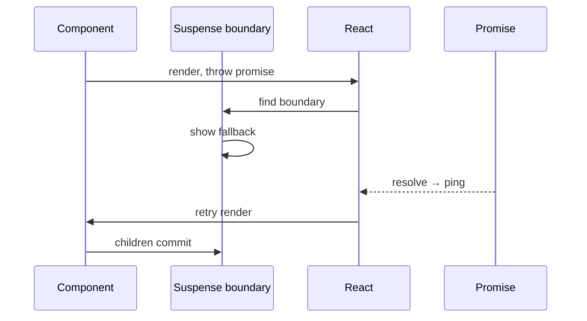

# Suspense

Suspense lets a component **declare** that it’s not ready by “suspending” — throwing a wakeable (Promise-like) — so React can show a fallback (or keep previous UI) and resume when data/code is ready. It’s a coordination primitive for **loading UI**, **code splitting**, and **streaming SSR**, not a data-fetching library by itself.

## The throw-a-promise model

```tsx
// Conceptual — many libraries wrap this
function use(promise: Promise<T>): T {
  if (promise.status === 'fulfilled') return promise.value
  if (promise.status === 'rejected') throw promise.reason
  throw promise // suspend
}

function Profile({ userId }: { userId: string }) {
  const user = use(fetchUser(userId)) // suspends until resolved
  return <h1>{user.name}</h1>
}

export function Page() {
  return (
    <Suspense fallback={<Skeleton />}>
      <Profile userId="1" />
    </Suspense>
  )
}
```

React 19’s `use()` reads resources (promises, context) and suspends on pending promises.



## Boundaries and granularity

```tsx
<Suspense fallback={<PageSkeleton />}>
  <Header /> {/* sync */}
  <Suspense fallback={<FeedSkeleton />}>
    <Feed /> {/* slow */}
  </Suspense>
  <Suspense fallback={<AdsSkeleton />}>
    <Ads />
  </Suspense>
</Suspense>
```

**Closer boundaries** → more of the page stays interactive; **one giant boundary** → whole section blank until slowest child ready.

Sibling Suspense boundaries can resolve independently under concurrent rendering.

## Lazy and code splitting

```tsx
import { lazy, Suspense } from 'react'

const Editor = lazy(() => import('./Editor'))

function App() {
  return (
    <Suspense fallback={<div>Loading editor…</div>}>
      <Editor />
    </Suspense>
  )
}
```

`React.lazy` ties dynamic `import()` to Suspense. Prefer route-level splits; micro-splitting every button hurts (waterfall of chunks).

## Data fetching patterns

### Classic waterfalls (anti-pattern without cache)

```tsx
// ❌ Fetch in child after parent mounts — parent Suspense resolves, then child suspends again
function Parent() {
  const user = use(fetchUser())
  return <Child userId={user.id} /> // Child fetches later
}
```

### Render-as-you-fetch

Start fetch **before** or **as** you render, keyed in a cache:

```tsx
const cache = new Map<string, Promise<User>>()

function fetchUser(id: string) {
  if (!cache.has(id)) cache.set(id, api.user(id))
  return cache.get(id)!
}
```

React Query / Relay / Next.js `fetch` cache / RSC all implement “don’t suspend on the same request twice” semantics.

### Suspense + Transitions

```tsx
const [isPending, startTransition] = useTransition()

function navigate(id: string) {
  startTransition(() => setUserId(id))
}
```

With transitions, React can **keep showing old UI** while the new suspended tree loads, instead of immediately flashing fallback — better for navigations.

## Error boundaries vs Suspense

| | Suspense | Error boundary |
| --- | --- | --- |
| Trigger | Pending wakeable | Thrown error |
| UI | `fallback` | `fallback` / `getDerivedStateFromError` |
| Recovery | Auto retry on resolve | Reset error state manually |

```tsx
<ErrorBoundary fallback={<ErrorUI />}>
  <Suspense fallback={<Loading />}>
    <Page />
  </Suspense>
</ErrorBoundary>
```

Always nest both for data UIs — network failures aren’t “pending forever.”

## SSR / streaming / hydration

On the server, Suspense boundaries flush HTML for ready content and emit fallback shells for pending regions; when data resolves, React streams replacements. On the client, hydration can attach selectively.

```tsx
// Next.js App Router — RSC + Suspense streaming
export default function Page() {
  return (
    <Suspense fallback={<PostSkeleton />}>
      <Post />
    </Suspense>
  )
}
```

Hydration mismatch if server fallback/content doesn’t match client’s first pass — keep fallbacks deterministic.

## Offscreen / hidden content (mental model)

React can keep hidden subtrees (tabs, lists) without unmounting — related to Suspense and concurrent prerendering. Don’t rely on undocumented internals; prefer patterns like keeping state lifted or using libraries that officially support activity/visibility APIs as they stabilize.

## Preloading

```tsx
// Warm cache before click
onMouseEnter={() => {
  void import('./Editor')
  preloadQuery(userId)
}}
```

Suspense still needs a boundary; preload just reduces fallback time.

## Interview Q&A

**Q: What does Suspense do?**  
A: Catches suspend signals from descendants and shows fallback (or preserves UI under transitions) until the resource resolves, then retries render.

**Q: Is Suspense a data library?**  
A: No — it’s a UI coordination mechanism. Fetching + caching is separate (RQ, Relay, RSC, `use` + cache).

**Q: Why cache promises?**  
A: Without identity-stable promises, every render throws a new promise → infinite suspend loop / refetch thrash.

**Q: Suspense vs `useEffect` loading flags?**  
A: Effects load after paint (waterfalls, empty flashes). Suspense integrates with SSR streaming and concurrent UX; still need a fetch strategy.

**Q: Can one boundary catch all?**  
A: Yes, but UX suffers. Prefer nested boundaries around independent slow parts.

**Q: What is `use()`?**  
A: React 19 API to read a promise/context during render; pending promise suspends.

## Common Mistakes

- Creating a new Promise every render without caching.
- Fetching only inside `useEffect` and expecting Suspense to help — it won’t see that.
- Missing Error boundaries around Suspense.
- Too fine-grained `lazy()` → request waterfalls.
- Using non-deterministic fallbacks (random keys, `Date.now()`) → hydration issues.
- Forgetting that suspended components don’t run effects until they successfully commit.

## Trade-offs

| Strategy | Pros | Cons |
| --- | --- | --- |
| Suspense + cache | Clean loading composition | Need cache discipline |
| Local `isLoading` state | Simple, explicit | Waterfalls; awkward SSR |
| Giant page boundary | Easy | Blank screens |
| Many tiny boundaries | Progressive reveal | Layout shift / complexity |
| Transition + Suspense | No fallback flash on nav | Pending UX must be designed |

**Senior takeaway:** Suspense is **control flow for async UI**. Pair it with a cache, error boundaries, sensible boundary placement, and transitions for navigation-grade UX.


## Wakeables & ping cache

When a promise resolves, React “pings” the root to retry the suspended lane. A **ping cache** avoids registering duplicate listeners on the same wakeable. Rejected promises propagate to Error Boundaries unless caught.

```ts
// Conceptual
promise.then(
  () => pingSuspendedRoot(root, wakeable, lane),
  () => pingSuspendedRoot(root, wakeable, lane),
)
```

## Suspense for CPU (not just IO)

Heavy CPU can theoretically be deferred via transitions rather than Suspense. Suspense is primarily for **async dependencies** (data/code). Don’t throw fake promises to “schedule” CPU — use `startTransition` / `useDeferredValue`.

## Extra Q&A

**Q: What happens to effects in a suspended tree?**  
A: They don’t run until the tree successfully commits. Cleanups from a previously shown tree may run when hiding/replacing.

**Q: Can Suspense catch errors?**  
A: No — only pending wakeables. Errors need Error Boundaries.


## Next.js + Suspense data

```tsx
// app/projects/page.tsx
export default function Page() {
  return (
    <Suspense fallback={<ProjectsSkeleton />}>
      <Projects />
    </Suspense>
  )
}

async function Projects() {
  const projects = await db.project.findMany() // streamed when ready
  return <ProjectTable rows={projects} />
}
```

Combine with `loading.tsx` for route-level and nested Suspense for widgets.
