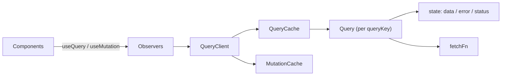
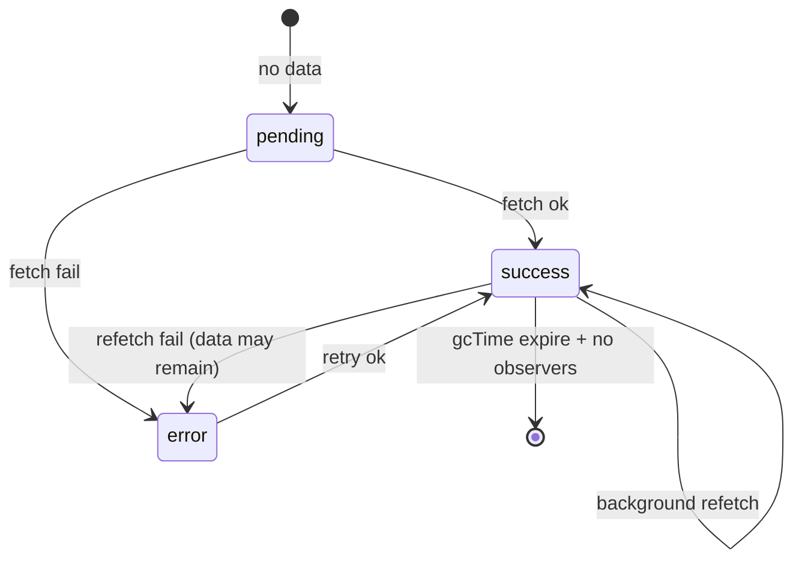

# React Query Internals

TanStack Query (React Query) is a **server-state cache** with a lifecycle: fetch, cache, dedupe, stale, refetch, garbage-collect. It sits outside React render (QueryClient) and notifies subscribers when cache entries change — solving problems `useEffect` + `useState` get wrong: race conditions, duplicate requests, stale data, and cache invalidation.

## Mental model



- **Server state** — owned by the server; client has a cached snapshot that can be stale.
- **Client state** — owned by the UI (`useState`); no network source of truth.

Don’t put form draft text in React Query; do put `/api/todos` lists there.

## queryKey identity

```ts
const key = ['todos', { status: 'done', page: 1 }] as const
// Serialized deterministically → cache entry id
```

Keys are hashed (stable JSON-like serialization). **Order and content matter.**

```ts
// Same intent, different keys → duplicate caches
useQuery({ queryKey: ['todo', id], queryFn })
useQuery({ queryKey: ['todo', { id }], queryFn }) // different entry
```

## Query lifecycle & states

```ts
status: 'pending' | 'error' | 'success'
fetchStatus: 'fetching' | 'paused' | 'idle'
// isLoading = pending && fetching
// isFetching = fetchStatus === 'fetching' (includes background)
// isStale = data older than staleTime
```



## staleTime vs gcTime

| Option | Meaning |
| --- | --- |
| `staleTime` | How long data is **fresh** — no refetch on remount/focus/reconnect (default `0` = immediately stale) |
| `gcTime` (formerly cacheTime) | How long unused data stays in cache after last observer unmounts (default ~5m) |

```ts
useQuery({
  queryKey: ['user', userId],
  queryFn: () => api.getUser(userId),
  staleTime: 60_000, // 1 min fresh
  gcTime: 10 * 60_000,
})
```

Fresh → show cache, skip network. Stale → show cache **and** refetch (stale-while-revalidate).

## Deduping & concurrency

Multiple `useQuery` with the same key share one Query instance → **one in-flight promise**.

```tsx
// Both components → single network call
function A() { useQuery({ queryKey: ['me'], queryFn: fetchMe }) }
function B() { useQuery({ queryKey: ['me'], queryFn: fetchMe }) }
```

Abort: Query uses `AbortSignal` when `queryFn` accepts `{ signal }`:

```ts
queryFn: async ({ signal }) => {
  const res = await fetch('/api/todos', { signal })
  return res.json()
}
```

## Observers & re-renders

Each `useQuery` creates an Observer with optional `select` / structural sharing. React Query notifies only when the **observed** slice changes (referential equality via structural sharing of `data`).

```ts
useQuery({
  queryKey: ['todos'],
  queryFn: fetchTodos,
  select: (data) => data.filter((t) => t.done), // fewer re-renders if select stable
})
```

## Invalidation & mutations

```ts
const qc = useQueryClient()

const mutation = useMutation({
  mutationFn: updateTodo,
  onSuccess: () => {
    void qc.invalidateQueries({ queryKey: ['todos'] })
  },
})
```

`invalidateQueries` marks matching queries stale and refetches **active** ones.

### Optimistic updates

```ts
useMutation({
  mutationFn: addTodo,
  onMutate: async (newTodo) => {
    await qc.cancelQueries({ queryKey: ['todos'] })
    const prev = qc.getQueryData<Todo[]>(['todos'])
    qc.setQueryData<Todo[]>(['todos'], (old) => [...(old ?? []), newTodo])
    return { prev }
  },
  onError: (_e, _v, ctx) => {
    qc.setQueryData(['todos'], ctx?.prev)
  },
  onSettled: () => qc.invalidateQueries({ queryKey: ['todos'] }),
})
```

## QueryClient defaults

```ts
const queryClient = new QueryClient({
  defaultOptions: {
    queries: {
      staleTime: 30_000,
      retry: 1,
      refetchOnWindowFocus: true,
    },
  },
})
```

## SSR / Next.js hydration

```ts
// Prefetch on server
await queryClient.prefetchQuery({ queryKey: ['posts'], queryFn: getPosts })
const dehydrated = dehydrate(queryClient)

// Client
<HydrationBoundary state={dehydrated}>
  <Posts />
</HydrationBoundary>
```

Avoid fetching only on the client when SEO/TTFB matter — prefetch + dehydrate.

## vs SWR vs Redux

| | React Query | SWR | Redux |
| --- | --- | --- | --- |
| Focus | Server cache | Server cache | General client state |
| Invalidation | Rich filters | Mutate/revalidate | DIY |
| Mutations | First-class | Manual | DIY |
| Devtools | Excellent | Good | Excellent |
| Boilerplate | Low for async | Low | Higher |

## Interview Q&A

**Q: Why not useEffect for fetching?**  
A: Races (ignore outdated responses), no dedupe, no shared cache, refetch storms on remount, weak invalidation story.

**Q: staleTime 0 meaning?**  
A: Data is stale immediately → remount/focus triggers background refetch while showing cached data.

**Q: Difference isLoading vs isFetching?**  
A: `isLoading` = no data yet and fetching. `isFetching` = any in-flight fetch including background.

**Q: How does invalidation work?**  
A: Marks queries stale by key predicate; active observers refetch; inactive stay stale until next mount.

**Q: Why queryKey arrays?**  
A: Hierarchical matching — `['todos']` invalidates `['todos', 1]` when fuzzy/prefix matching configured.

**Q: Where is the cache stored?**  
A: In-memory on `QueryClient` (Map of queries). Persist plugins optional (localStorage).

## Common Mistakes

- Unstable `queryKey` (new object literal identity inside key without structural content care — actually content is hashed; bigger issue is including non-serializable values).
- Putting `staleTime: Infinity` then wondering why UI never updates — forgot invalidation.
- Using React Query for all client state.
- Ignoring `signal` → setState on unmounted / wasted work.
- `queryKey` missing variables used inside `queryFn` → wrong cache / stale closures.
- Over-invalidating entire cache on every mutation.

## Trade-offs

| Choice | Benefit | Cost |
| --- | --- | --- |
| Global QueryClient | Shared cache | Memory; need defaults discipline |
| staleTime 0 | Always fresh | More network |
| Long staleTime | Perf / cost | Risk of stale UI without invalidation |
| Optimistic UI | Instant feel | Rollback complexity |
| select | Render perf | Must keep selector stable / pure |

**Senior takeaway:** React Query is an **async cache with observers**. Interview answers should hit queryKey identity, stale-while-revalidate, deduping, invalidation, and optimistic updates — not just “it fetches data.”


## Query defaults & retry

```ts
useQuery({
  queryKey: ['orders', id],
  queryFn: fetchOrder,
  retry: (count, err) => (err as any).status !== 404 && count < 3,
  retryDelay: (n) => Math.min(1000 * 2 ** n, 30_000),
  refetchOnReconnect: true,
  refetchInterval: false, // or ms for polling
})
```

## Dependent queries

```ts
const user = useQuery({ queryKey: ['user'], queryFn: getUser })
const orgs = useQuery({
  queryKey: ['orgs', user.data?.id],
  queryFn: () => getOrgs(user.data!.id),
  enabled: !!user.data?.id,
})
```

## Infinite queries

```ts
useInfiniteQuery({
  queryKey: ['feed'],
  queryFn: ({ pageParam }) => fetchFeed(pageParam),
  initialPageParam: 0,
  getNextPageParam: (last) => last.nextCursor,
})
```

## Extra Q&A

**Q: structuralSharing?**  
A: RQ keeps referentially stable parts of `data` when JSON shape unchanged — reduces re-renders.

**Q: placeholderData / keepPreviousData?**  
A: Show prior list while queryKey changes (pagination UX) without full loading flash.


## QueryClient imperative API (non-hook)

```ts
await queryClient.prefetchQuery({ queryKey: ['post', id], queryFn: () => getPost(id) })
queryClient.setQueryData(['post', id], (old) => old && { ...old, title: 'x' })
const data = queryClient.getQueryData<Post>(['post', id])
await queryClient.ensureQueryData({ queryKey: ['post', id], queryFn: () => getPost(id) })
```

Use in route loaders, event handlers, and SSR prefetch. Hooks are for reactive subscription; imperative API is for one-shot cache surgery.

## Error & empty states matrix

| State | UI |
| --- | --- |
| `isLoading` | Full-page skeleton |
| `isFetching && !isLoading` | Subtle bar / opacity |
| `isError` | Retry button calling `refetch()` |
| `isSuccess && data.length===0` | Empty state (not error) |
