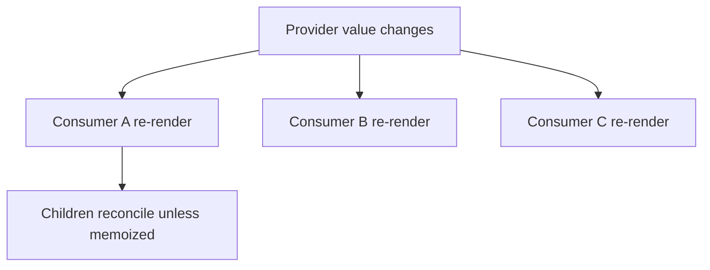
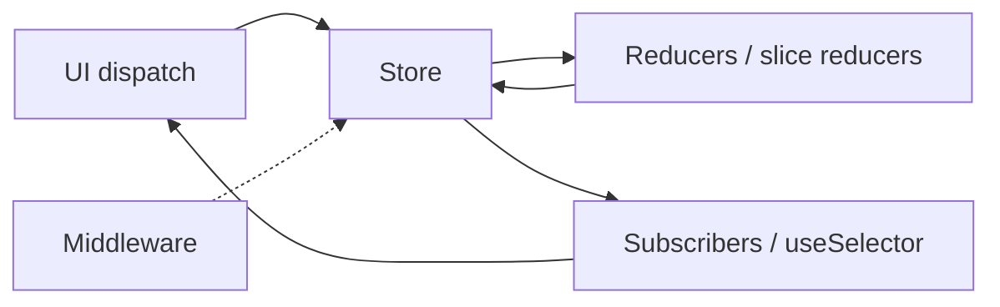

# Context vs Redux

Both move state through the tree without prop drilling. They solve **different** problems: Context is a dependency-injection / broadcast primitive built into React; Redux (or Zustand, Jotai, etc.) is a **state container** with predictable updates, middleware, and selective subscriptions. Senior interviews test whether you know when Context re-renders hurt and what Redux actually adds.

## Context internals

```tsx
const ThemeContext = createContext<{ theme: string; setTheme: (t: string) => void } | null>(null)

function ThemeProvider({ children }: { children: React.ReactNode }) {
  const [theme, setTheme] = useState('dark')
  const value = useMemo(() => ({ theme, setTheme }), [theme])
  return <ThemeContext.Provider value={value}>{children}</ThemeContext.Provider>
}

function useTheme() {
  const ctx = useContext(ThemeContext)
  if (!ctx) throw new Error('useTheme within provider')
  return ctx
}
```

When `Provider`’s `value` changes (`Object.is`), **every consumer that read that context during render re-renders** — React doesn’t do deep selective subscriptions for `useContext`.



### Context bailout myth

`React.memo` on a child **does not** skip context-driven updates if that child calls `useContext`. Memo only skips when props are equal **and** the component itself isn’t invalidated by context.

Split contexts to limit blast radius:

```tsx
const ThemeValueContext = createContext('dark')
const ThemeSetterContext = createContext<(t: string) => void>(() => {})
// Components that only set theme don’t re-render when theme string changes
```

## Redux architecture



```ts
// Redux Toolkit
const counterSlice = createSlice({
  name: 'counter',
  initialState: { value: 0 },
  reducers: {
    incremented(state) {
      state.value += 1 // Immer
    },
  },
})

const store = configureStore({
  reducer: { counter: counterSlice.reducer },
})

type RootState = ReturnType<typeof store.getState>
```

```tsx
const value = useSelector((s: RootState) => s.counter.value) // only re-renders if selected slice changes by ===
const dispatch = useDispatch()
```

`useSelector` runs after store updates; if selected reference equals previous (`===`), **skip re-render**. That’s the key difference from Context.

## Comparison matrix

| | Context | Redux Toolkit | Zustand | React Query |
| --- | --- | --- | --- | --- |
| Built-in | Yes | No | No | No |
| Selective subscribe | No (per context) | Yes | Yes | Yes (per query) |
| Middleware / DevTools | DIY | Excellent | Good | Query Devtools |
| Boilerplate | Low | Medium (RTK low) | Very low | Low for server |
| Best for | Theme, auth session DI, i18n | Complex client domain state | Local/global client state | Server cache |

## When Context is enough

- Theme, locale, viewport breakpoint
- Auth user object that rarely changes
- Dependency injection (services, feature flags static per session)
- Tree-local state (compound components)

## When you want a store

- Frequent updates (mouse position, keystrokes into global store — careful)
- Many independent subscribers needing slices
- Time-travel / action logging / complex update pipelines
- Cross-route client state with clear actions

## Performance patterns

### Context: split + memo children

```tsx
function Shell({ children }: { children: React.ReactNode }) {
  const [count, setCount] = useState(0)
  return (
    <CountContext.Provider value={count}>
      <button onClick={() => setCount((c) => c + 1)}>+</button>
      {children} {/* pass children from parent so Shell re-render doesn’t recreate them */}
    </CountContext.Provider>
  )
}
```

### Redux: normalize + selectors

```ts
const selectPostById = (id: string) => (s: RootState) => s.posts.entities[id]
// Reselect / RTK createSelector for derived data memoization
```

### Zustand (common alternative)

```ts
const useBearStore = create<{ bears: number; inc: () => void }>((set) => ({
  bears: 0,
  inc: () => set((s) => ({ bears: s.bears + 1 })),
}))

const bears = useBearStore((s) => s.bears) // selector subscription
```

## Prop drilling vs composition

Before Context/Redux, prefer composition:

```tsx
function Page() {
  const [user, setUser] = useState<User | null>(null)
  return (
    <Layout sidebar={<UserPanel user={user} />} main={<Feed user={user} />} />
  )
}
```

Context isn’t free — don’t use it to avoid passing 2 props.

## Interview Q&A

**Q: Does Context replace Redux?**  
A: For low-frequency, broad concerns, yes. For high-frequency selective updates and complex transitions, a store with selectors is usually better.

**Q: Why does Context re-render all consumers?**  
A: `useContext` subscribes to the whole value; React re-renders on `Object.is` value change. No field-level subscription.

**Q: How does useSelector prevent re-renders?**  
A: Compares previous selected value with next (`===` by default); skips if equal.

**Q: Redux vs React Query?**  
A: Redux = client/domain state. RQ = server cache. Can coexist; don’t duplicate server lists in Redux without reason.

**Q: Is Redux still relevant in 2025?**  
A: Yes for large apps needing discipline, middleware, DevTools. Many apps choose Zustand + RQ instead — say trade-offs, not dogma.

**Q: What is Immer in RTK?**  
A: Lets you write “mutating” reducer syntax that produces immutable updates — fewer spread bugs.

## Common Mistakes

- Putting rapidly changing values in Context (e.g. every mousemove) → app-wide re-renders.
- Unstable Context `value={{ theme, setTheme }}` without `useMemo` → new object every provider render → all consumers update every time.
- Using Redux for all server data without RQ/cache layer.
- Giant monolithic context object.
- Selecting entire store: `useSelector(s => s)` — defeats selective render.

## Trade-offs

| Approach | Pros | Cons |
| --- | --- | --- |
| Context only | Zero deps, simple | Re-render blast radius |
| Split contexts | Smaller updates | Provider nesting |
| Redux Toolkit | Structure, DevTools | Concepts overhead |
| Zustand | Minimal API | Less “enterprise” convention |
| RQ + local state | Clear server/client split | Two mental models |

**Senior takeaway:** Context = broadcast by value identity. Redux/Zustand = subscribe by selector. Choose based on **update frequency** and **subscription granularity**, not fashion.


## Flux legacy & RTK Query

Redux Toolkit + RTK Query overlaps React Query for server cache. Prefer **one** server-cache library. RTK Query fits if you’re already all-in on Redux; RQ + Zustand is a common lighter split.

## Selector equality functions

```tsx
import { shallowEqual } from 'react-redux'
const { a, b } = useSelector((s) => ({ a: s.a, b: s.b }), shallowEqual)
// without shallowEqual, new object every time → always re-render
```

## Extra Q&A

**Q: Can Context + memo replace Redux?**  
A: For small apps/low frequency, yes. At scale, selector stores win on subscription granularity.
