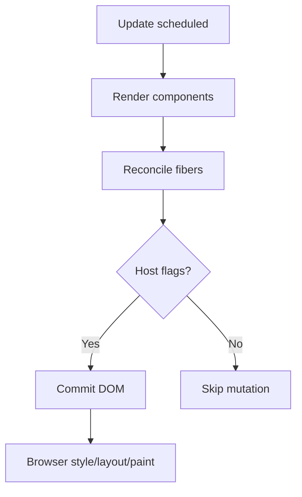

# Rendering Optimization

Optimization in React means **doing less work**: fewer component functions run, less reconciliation, less DOM mutation, less layout/paint. Measure first (React Profiler, Chrome Performance) — premature `memo` is noise. Senior answers tie symptoms (jank, slow typing) to causes (wide re-renders, expensive children, layout thrash).

## What triggers a re-render?

A component re-renders when:

1. Its own state/context changes
2. Its parent re-renders **and** it isn’t bailed out (`memo` + equal props, or same element reference tricks)
3. A store selector it uses returns a new value

Re-render ≠ DOM update. If output is identical, commit may skip host work — but JS still ran.



## Strategy ladder

1. **Move state down** — don’t store keystrokes in a giant parent.
2. **Lift content / children** — stable `children` don’t recreate when wrapper state changes.
3. **Split components** — isolate high-frequency state.
4. **Memoize selectively** — `memo` / `useMemo` where profiling shows cost.
5. **Virtualize** — don’t mount 10k rows.
6. **Concurrent** — `startTransition` for heavy UI behind urgent input.
7. **Compiler** — React Compiler auto-memo where safe (see chapter 11).

## State colocation

```tsx
// ❌ Every keystroke re-renders ExpensiveTree
function Page() {
  const [q, setQ] = useState('')
  return (
    <>
      <input value={q} onChange={(e) => setQ(e.target.value)} />
      <ExpensiveTree />
    </>
  )
}

// ✅ Search owns the state
function Page() {
  return (
    <>
      <SearchBox />
      <ExpensiveTree />
    </>
  )
}
```

## Children as bailout

```tsx
function App() {
  const [n, setN] = useState(0)
  return (
    <div>
      <button onClick={() => setN((x) => x + 1)}>{n}</button>
      <SlowPanel>
        <ExpensiveTree /> {/* element created in App — wait, still new each App render */}
      </SlowPanel>
    </div>
  )
}

// Better: create expensive element outside the state owner
function App() {
  return <Shell expensive={<ExpensiveTree />} />
}
function Shell({ expensive }: { expensive: React.ReactNode }) {
  const [n, setN] = useState(0)
  return (
    <>
      <button onClick={() => setN((x) => x + 1)}>{n}</button>
      {expensive} {/* same reference across Shell renders */}
    </>
  )
}
```

## Lists & keys

- Virtualize long lists (`react-window`, TanStack Virtual).
- Stable keys; avoid remounting.
- Don’t put heavy work in render of each cell — precompute or memo cells.

```tsx
const Row = memo(function Row({ item }: { item: Item }) {
  return <div>{item.name}</div>
})
```

## Derived state & render cost

```tsx
// Prefer deriving in render (cheap)
const done = todos.filter((t) => t.done)

// useMemo only if filter is expensive / referential stability needed
const done = useMemo(() => todos.filter((t) => t.done), [todos])
```

Avoid syncing props → state in effects when you can compute.

## Layout thrashing

```tsx
// ❌ Read/write interleave forces multiple layouts
items.forEach((el) => {
  const h = el.offsetHeight // layout read
  el.style.height = h + 10 + 'px' // write
})

// ✅ Batch reads then writes
const heights = items.map((el) => el.offsetHeight)
items.forEach((el, i) => {
  el.style.height = heights[i] + 10 + 'px'
})
```

Prefer CSS; use `useLayoutEffect` only when measuring before paint.

## Images, CSS, JS cost outside React

- `content-visibility`, CSS containment
- Debounce resize/scroll handlers
- `will-change` sparingly
- Code-split routes

## Profiling checklist

| Symptom | Likely cause | Fix direction |
| --- | --- | --- |
| Typing lag | Parent re-render of heavy tree | Colocate / transition / memo |
| Scroll jank | Too many DOM nodes | Virtualize |
| Click delay | Sync heavy work in handler | `startTransition` / defer |
| Hydration slow | Huge SSR HTML | Stream + smaller islands |
| Constant CPU | Context / store thrash | Split subscriptions |

```tsx
// React Profiler API
<Profiler id="Feed" onRender={(id, phase, actualDuration) => {
  if (actualDuration > 16) console.warn(id, phase, actualDuration)
}}>
  <Feed />
</Profiler>
```

## Interview Q&A

**Q: How do you find React performance issues?**  
A: Reproduce → Profiler (commit durations, why did this render?) → fix highest cost → verify. Don’t spray `memo`.

**Q: Does memo always help?**  
A: No — comparison cost + still re-renders if props change every time (inline objects/functions).

**Q: Re-render vs repaint?**  
A: Re-render = JS React work. Repaint/reflow = browser after DOM/style changes.

**Q: Why virtualize?**  
A: Mounting thousands of components/DOM nodes dominates; windowing keeps DOM ~O(viewport).

**Q: When startTransition?**  
A: Heavy UI updates that can lag behind urgent input feedback.

## Common Mistakes

- Memoizing everything “for best practices.”
- Inline `style={{}}` / `onClick={() => {}}` breaking memo.
- Giant Context for high-frequency data.
- Optimizing before measuring.
- Deriving state in effects causing double renders/loops.

## Trade-offs

| Technique | Gain | Cost |
| --- | --- | --- |
| State colocation | Often biggest win | More structure |
| `memo` | Skip subtrees | Prop stability discipline |
| Virtualization | Scales lists | Complexity, a11y/scroll restore |
| Transitions | Input responsiveness | Pending UX |
| Code splitting | Faster TTI | Waterfalls if overdone |

**Senior takeaway:** Optimize **render width** (who runs) and **render weight** (how expensive), then DOM size. Context: measure → colocate → memoize → virtualize → concurrent.


## Concurrent + memo together

`memo` reduces render work; transitions reduce **how urgently** remaining work runs. Use both: memo list rows + transition for filter query.

## Network waterfalls as “perf”

React Profiler won’t show API waterfalls — use Network panel. Prefetch on hover; parallelize server awaits; avoid RQ dependent chains when parallel is possible.

## Extra Q&A

**Q: Is `React.lazy` a perf win?**  
A: For route-level code yes; over-splitting causes waterfalls and delays interactivity.


## Case study: chat message list

Symptoms: typing in composer drops to 20fps; scrolling janks at 2k messages.

Diagnosis path:

1. Profiler shows `App` re-rendering on each keystroke  
2. `messages.map` recreates all `Message` rows  
3. DOM node count ~2k  

Fixes in order:

```tsx
// 1. Colocate composer state
function Chat() {
  return (
    <>
      <MessageViewport />
      <Composer />
    </>
  )
}

// 2. Memo rows + stable handlers
const Message = memo(function Message({ id, body, onReact }: Props) {
  return <div onDoubleClick={() => onReact(id)}>{body}</div>
})

// 3. Virtualize
import { useVirtualizer } from '@tanstack/react-virtual'
```

4. Put emoji reactions in transition if they reflow a heavy side panel.

## INP / long tasks

Interaction to Next Paint (INP) suffers when click handlers do heavy sync work. Patterns:

- `startTransition` for non-urgent derived UI  
- Defer analytics with `requestIdleCallback` / `queueMicrotask` carefully  
- Move CPU to Worker for parse/filter of large JSON  

```tsx
function onClick() {
  flushSync(() => setPressed(true)) // optional immediate pressed style
  startTransition(() => setHeavyPanel(compute()))
}
```

## Extra mistakes

- Measuring only prod after shipping — profile on mid-tier mobiles  
- Forgetting that DevTools React Profiler overhead skews absolute times — use relative comparisons  
