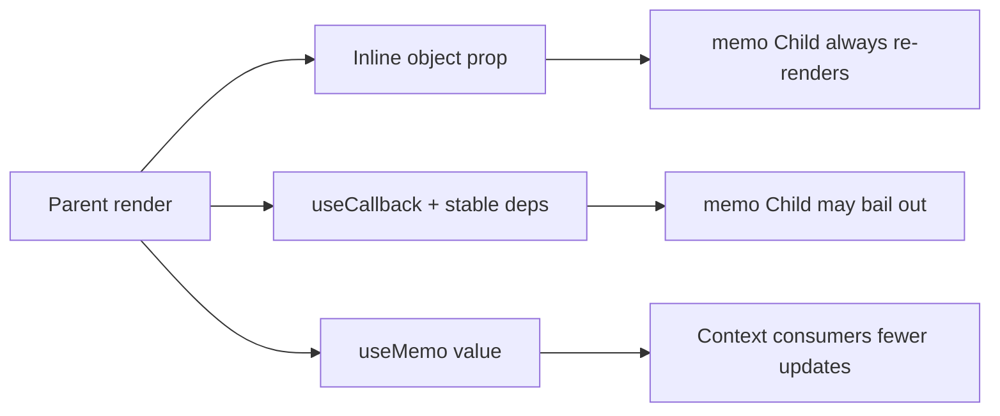

# Memoization

`React.memo`, `useMemo`, and `useCallback` are **referential stability / bailout** tools. They don’t make algorithms faster by magic — they skip work when inputs are `Object.is`-equal. React Compiler (chapter 11) automates many of these; you still need the mental model for interviews and escape hatches.

## Object.is equality

Deps and memo props use `Object.is`:

- `Object.is(NaN, NaN) === true`
- `Object.is(+0, -0) === false`
- Objects/arrays/functions equal only by **same reference**

```tsx
<Child options={{ page: 1 }} /> // new object every parent render → memo useless
```

## React.memo

```tsx
type Props = { userId: string; onSelect: (id: string) => void }

const UserRow = memo(function UserRow({ userId, onSelect }: Props) {
  return <button onClick={() => onSelect(userId)}>{userId}</button>
})

// Custom compare (rare — easy to get wrong)
memo(UserRow, (prev, next) => prev.userId === next.userId)
```

Bailout when props equal → React reuses previous fiber output (skips rendering the function). Children elements still matter if you render them inside without memo.

## useMemo

```tsx
const sorted = useMemo(() => {
  return [...items].sort((a, b) => a.name.localeCompare(b.name))
}, [items])
```

Use when:

1. Computation is expensive **and** runs often with same inputs
2. You need a **stable reference** for child memo / effect deps / context value

```tsx
const value = useMemo(() => ({ theme, setTheme }), [theme]) // context stability
```

React 19 docs: treat as optimization hint — in future React may recompute sometimes. Don’t put side effects inside `useMemo`.

## useCallback

```tsx
const onSelect = useCallback((id: string) => {
  dispatch({ type: 'select', id })
}, [dispatch])

return <UserRow userId={id} onSelect={onSelect} />
```

Equivalent to `useMemo(() => fn, deps)`. Needed when passing callbacks to `memo` children or as effect deps.

## When memoization fails

```tsx
function Parent({ items }: { items: Item[] }) {
  const [sel, setSel] = useState<string | null>(null)
  // ❌ new function every time — Child memo broken
  return items.map((it) => (
    <Child key={it.id} item={it} onClick={() => setSel(it.id)} />
  ))
}

// ✅ stable handler + id in child / or pass setSel if stable
const onClick = useCallback((id: string) => setSel(id), [])
```

Context: if Parent consumes frequently changing context, it re-renders anyway — memo children help only if their props stay stable.

## Referential stability graph



## Cost of memoization

- Dependency comparison every render
- Memory of cached values
- Complexity / stale-deps bugs
- Over-memo can be slower for cheap components

Rule of thumb: memo **list items**, **heavy pure trees**, **context values**, **selectors** — not every leaf `<Button>`.

## useRef vs useMemo for “latest”

```tsx
// Stable callback always seeing latest state without re-creating
function useEvent<T extends (...args: any[]) => any>(fn: T): T {
  const ref = useRef(fn)
  useLayoutEffect(() => {
    ref.current = fn
  })
  return useCallback(((...args) => ref.current(...args)) as T, [])
}
```

React 19 `useEffectEvent` formalizes the “event” pattern — not a dep, always fresh.

## Memo + lists

```tsx
const Row = memo(function Row({ id, name, selected, onSelect }: RowProps) {
  return (
    <div className={selected ? 'on' : ''} onClick={() => onSelect(id)}>
      {name}
    </div>
  )
})
```

Ensure `selected` boolean doesn’t force **all** rows to update — pass `selected={id === sel}` still changes props for two rows (old + new); that’s correct and minimal.

## Interview Q&A

**Q: Difference useMemo vs useCallback?**  
A: `useMemo` caches a value; `useCallback` caches a function. `useCallback(fn, d)` ≡ `useMemo(() => fn, d)`.

**Q: Does useMemo run on server?**  
A: Yes during SSR render — don’t put browser-only side effects in it.

**Q: Why is my memo component still rendering?**  
A: Props changed by reference, context changed, or parent key remounted.

**Q: Is memoizing context value required?**  
A: If Provider re-renders for unrelated state and value is a new object literal, yes — otherwise all consumers thrash.

**Q: Can you replace all this with the Compiler?**  
A: Often yes for local memo; still understand rules for debugging and for values the compiler won’t auto-handle (complex patterns).

## Common Mistakes

- `useMemo` for trivial math.
- Missing deps → stale bugs; eslint-disable without thought.
- `useCallback` without memoized child — no benefit.
- Custom `memo` comparators that skip needed updates.
- Using memo to “fix” impure render (should fix purity).

## Trade-offs

| Tool | Best for | Risk |
| --- | --- | --- |
| `memo` | Pure heavy children / list rows | Broken by unstable props |
| `useMemo` | Expensive derive / stable objects | Fake deps / overuse |
| `useCallback` | Stable handlers for memo/effects | Same as useMemo |
| Compiler | Default auto-memo | Escapes / understanding still needed |
| None | Simple components | Cleaner code |

**Senior takeaway:** Memoization is about **reference equality enabling bailouts**. Stabilize props/values intentionally; measure; prefer structural fixes (state location) over wrapping everything.


## Compiler-era guidance

With React Compiler enabled, delete redundant `useMemo`/`useCallback` unless:

1. ESLint marks a hard escape  
2. A third-party API requires stable identity you want explicit  
3. Profiling shows a remaining hot path outside compiler scope  

## Extra Q&A

**Q: useMemo for correctness?**  
A: No — only performance/referential stability. Semantic correctness shouldn’t depend on memo.


## Dependency array discipline

```tsx
// ❌ eslint-disable without understanding
useMemo(() => hash(items), []) // stale forever

// ✅
useMemo(() => hash(items), [items])

// ✅ if items is new array each parent render with same contents —
// fix parent to stabilize OR deep-compare carefully (usually fix parent)
```

Libraries like `use-deep-compare-effect` exist but often hide prop instability — prefer fixing identity at the source.

## Context value pattern (canonical)

```tsx
function AuthProvider({ children }: { children: React.ReactNode }) {
  const [user, setUser] = useState<User | null>(null)
  const value = useMemo(() => ({ user, setUser }), [user])
  return <AuthContext.Provider value={value}>{children}</AuthContext.Provider>
}
```

With Compiler, `useMemo` may be unnecessary; the **intent** (stable value object) remains the interview talking point.

## Extra Q&A

**Q: Should list `map` callbacks be useCallback?**  
A: Usually no — the callback is recreated each parent render anyway unless the parent itself is memoized and you pass the callback as a prop to a memo child list container.
