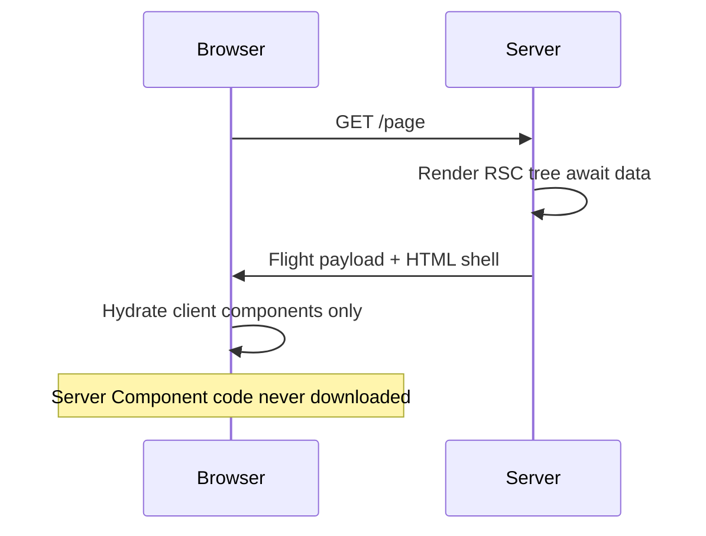

# React Server Components

React Server Components (RSC) are a **component model** where some components render **only on the server** (or at build time), never shipping their code or dependencies to the client. They compose with Client Components to form a hybrid tree. Next.js App Router is the primary production vehicle; the mental model is React’s, not Next-only.

## Server vs Client components

| | Server Component (default in App Router) | Client Component (`'use client'`) |
| --- | --- | --- |
| Runs | Server / build | Server (SSR/SSR pass) + browser |
| Bundle | Not in client JS | In client JS |
| Hooks / state | No | Yes |
| Browser APIs | No | Yes |
| Can import | Server + Client children | Client only (not Server modules) |
| Data fetch | Direct `await` DB/API | Via hooks, RQ, etc. |

```tsx
// app/page.tsx — Server Component
import { db } from '@/db'
import { LikeButton } from './like-button' // client

export default async function Page() {
  const posts = await db.post.findMany() // zero client cost for db driver
  return (
    <ul>
      {posts.map((p) => (
        <li key={p.id}>
          {p.title} <LikeButton id={p.id} />
        </li>
      ))}
    </ul>
  )
}
```

```tsx
// like-button.tsx
'use client'
import { useState } from 'react'

export function LikeButton({ id }: { id: string }) {
  const [n, setN] = useState(0)
  return <button onClick={() => setN((x) => x + 1)}>👍 {n}</button>
}
```

## The RSC payload

Server Components don’t send HTML alone for the interactive model — they send a **serialized component flight payload** (RSC wire format) describing the server-rendered tree, with placeholders for Client Component references. The client React runtime merges that with client bundles.



## Import rules (the “use client” boundary)

- `'use client'` marks the **entry** of a client subgraph — that module and its imports become client.
- Server Components may render Client Components as children.
- Client Components **cannot** import Server Component modules directly.
- Pass Server Components as **`children`** or props into Client wrappers (composition):

```tsx
// Client shell wrapping server-provided children
'use client'
export function Modal({ children }: { children: React.ReactNode }) {
  const [open, setOpen] = useState(true)
  if (!open) return null
  return <div className="modal">{children}</div>
}

// Server
<Modal>
  <ExpensiveServerReport /> {/* still a Server Component */}
</Modal>
```

## Data fetching & waterfalls

```tsx
// Parallel
const [user, posts] = await Promise.all([getUser(), getPosts()])

// Sequential when needed
const user = await getUser()
const posts = await getPostsFor(user.id)
```

Prefer parallel. Use Suspense boundaries to stream slow segments.

## Serialization boundary

Props from Server → Client must be **serializable** (JSON-like + a few extensions: Date, etc. per runtime). Functions cannot cross unless they’re Server Actions.

```tsx
// ❌
<Client onClick={() => doSecret()} />

// ✅ Server Action
async function doSecret() {
  'use server'
  // ...
}
<Client action={doSecret} />
```

## Shared components

A component without `'use client'` and without server-only APIs can be imported from both — it becomes part of whichever side imported it. If a Client file imports it, it’s bundled for client.

Mark server-only modules:

```ts
import 'server-only'
export async function getSecrets() { /* ... */ }
```

## When to use RSC

- Data-heavy pages, dashboards, content
- Keep secrets / large deps (ORM, markdown parsers) off client
- Reduce JS bundle for static content chrome

Keep Client for: interactivity, effects, browser APIs, context that updates often.

## Interview Q&A

**Q: Do Server Components hydrate?**  
A: Their output is present in the tree; they don’t hydrate as interactive React state — only Client Components hydrate.

**Q: Can RSC use useState?**  
A: No. Stateful interactivity requires Client Components (or URL/server state).

**Q: How do you pass server data to client?**  
A: As serializable props, or via children composition, or fetch on client if needed.

**Q: RSC vs SSR?**  
A: SSR renders HTML for Client Components on the server for FCP/SEO. RSC is a separate programming model that keeps code on the server. App Router does both.

**Q: Why can’t client import server components?**  
A: Server modules may use Node APIs/secrets; the bundler boundary enforces they never enter the client graph. Composition via children is the escape hatch.

## Common Mistakes

- Sprinkling `'use client'` at the page top → entire page becomes client.
- Passing non-serializable props (class instances, functions) across boundary.
- Fetching in client what could be awaited in RSC.
- Creating waterfalls of nested async server components without Suspense/parallel.
- Using RSC for highly interactive canvases — wrong tool.

## Trade-offs

| Choice | Pros | Cons |
| --- | --- | --- |
| Default Server | Smaller bundles, secure data access | Mental model / boundaries |
| Heavy Client | Familiar SPA DX | Larger JS, more hydration |
| Fine-grained client leaves | Best of both | Prop serialization discipline |
| Everything SSR Client | Simple | Ships unused server-capable code |

**Senior takeaway:** RSC pushes **code and data access** to the server; Client Components are the interactive islands. Master the import boundary, serializable props, and composition-via-children pattern.


## Flight protocol (high level)

The wire format is a streamed module/reference graph: server outputs records describing elements, text, and client references (`$L` style IDs in popular explainers). Client runtime resolves client module IDs to exports from webpack/turbopack chunks.

## Partial prerendering (PPR) awareness

Next.js PPR (evolving) combines static shell with dynamic holes — RSC + Suspense streaming. Interview: know the **goal** (static shell + dynamic slots) even if flags change names.

## Extra Q&A

**Q: Can RSC have effects?**  
A: No client effects. Server can do async work during render (await), which is different from `useEffect`.
