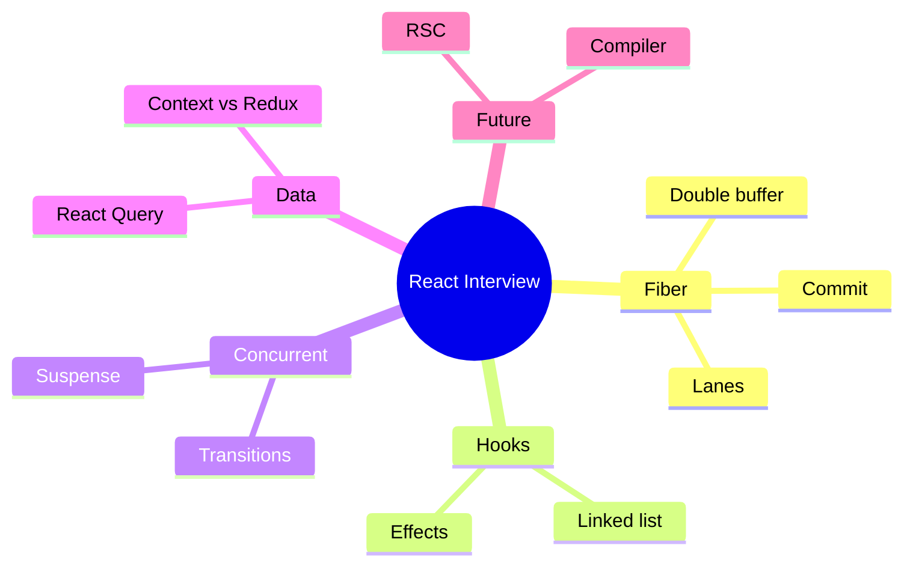

# React Interview Q&A

Dense drill set spanning Fiber → Compiler. Answer out loud in 60–90s, then peek. Follow-ups are what seniors get.

## Topic map

## Fiber & reconciler

**Q1. What is Fiber and why did React rewrite the reconciler?**  
A: Fiber is the unit of work / linked-list tree enabling interruptible, prioritized rendering. Stack reconciler couldn’t pause mid-tree; Fiber can yield, resume, and abort stale work for concurrent features.

*Follow-up:* Where are hooks stored? → `fiber.memoizedState` linked list.

**Q2. Explain current vs workInProgress.**  
A: Double buffering. Current is on screen; WIP is built during render; on commit, root pointer flips. Interruptions discard WIP without touching visible DOM.

**Q3. What are lanes?**  
A: Bitmask priorities for updates. Cheap merge/intersect; scheduler picks highest priority lane set; transitions use lower lanes than input.

**Q4. Can commit be interrupted?**  
A: No. Render yes; commit sync for DOM consistency.

## Reconciliation & keys

**Q5. How does reconciliation decide reuse vs remount?**  
A: Same `type` + same `key` among siblings → reuse fiber and update. Different type → remount. Keys provide sibling identity.

**Q6. Why are index keys dangerous?**  
A: Insert/delete/reorder makes indexes unstable → state attaches to wrong item; inputs “jump.”

**Q7. Does React diff against the real DOM?**  
A: Diffs previous React tree (elements/fibers) then applies host operations to DOM.

## Hooks

**Q8. Why rules of hooks?**  
A: Hook identity is call-order position in a list. Conditionals change positions → wrong state.

**Q9. How does setState work across async?**  
A: Dispatch closes over fiber + update queue, not render snapshot; schedules lanes; next render processes queue (supports functional updates).

**Q10. useEffect vs useLayoutEffect?**  
A: Layout before paint (DOM measure/sync). Effect after paint (subscriptions). Cleanups run before next create / on unmount.

**Q11. Why Object.is for deps?**  
A: Same as `===` except NaN/±0 edge cases — stable equality for deps.

**Q12. Stale closure fix patterns?**  
A: Correct deps; functional updates; refs for latest; `useEffectEvent`.

## Concurrent

**Q13. What does startTransition do?**  
A: Marks updates lower priority / interruptible so urgent updates (typing) stay responsive; exposes `isPending`.

**Q14. useDeferredValue vs useTransition?**  
A: Deferred = lag a derived value. Transition = wrap the state update. Both enable concurrent UX.

**Q15. What is tearing? Fix?**  
A: Inconsistent store snapshots mid-render under concurrency. Use `useSyncExternalStore`.

**Q16. Automatic batching?**  
A: React 18 `createRoot` batches setStates across timeouts/promises/events; `flushSync` escapes.

## Suspense

**Q17. How does Suspense work?**  
A: Descendant suspends (throws wakeable) → nearest boundary shows fallback → retry on resolve. Needs cached promises.

**Q18. Suspense vs Error Boundary?**  
A: Pending vs error. Use both.

**Q19. Why cache the promise?**  
A: New promise each render → suspend forever / refetch thrash.

## Data & state

**Q20. React Query vs Context vs Redux?**  
A: RQ = server cache (staleTime, invalidation, dedupe). Context = DI/broadcast (all consumers on value change). Redux/Zustand = client store with selective subscribe.

**Q21. staleTime vs gcTime?**  
A: Freshness window vs how long unused cache entries live after unmount.

**Q22. Why Context re-renders everyone?**  
A: `useContext` subscribes to whole value identity; no field selectors.

## Optimization & memo

**Q23. First React perf step?**  
A: Measure (Profiler). Then colocate state, then memo/virtualize/transitions.

**Q24. When does memo fail?**  
A: Inline objects/functions new each time; context changes; custom compare wrong.

**Q25. useMemo vs useCallback?**  
A: Value vs function; callback = memo of function.

## RSC & Compiler

**Q26. Server vs Client Component?**  
A: Server: no hooks, can await data, code stays server. Client: `'use client'`, interactive, hydrates. Server can render Client; Client can’t import Server — pass as children.

**Q27. RSC vs SSR?**  
A: SSR = HTML for faster first paint/hydration of client trees. RSC = execution venue / bundle boundary for components.

**Q28. What is React Compiler?**  
A: Build-time auto-memoization under purity rules; reduces manual memo hooks.

## Rapid-fire (one sentence)

| Q | A |
| --- | --- |
| Virtual DOM purpose? | Cheap describe UI; reconcile to host ops — not “always faster than DOM.” |
| Controlled input? | Value from state + onChange updates state. |
| Key on Component type change? | Remount; state lost. |
| Strict Mode double effect? | Dev-only mount/unmount/remount to catch missing cleanups. |
| Portal? | Render children into another DOM node; events still bubble in React tree. |
| forwardRef / useImperativeHandle? | Expose custom imperative API to parents. |
| hydrateRoot? | Attach listeners to server HTML. |
| flushSync? | Force sync DOM update — rare. |
| Why not fetch in render without cache? | Duplicate requests / Suspense loops. |
| Batching in React 17 vs 18? | 17 mostly events; 18 broader with createRoot. |

## Scenario prompts

**S1. Search box freezes on each keystroke with a 5k-item filter.**  
Urgent `setInput` + `startTransition` for query / `useDeferredValue`; virtualize list; consider workers for filter; memo rows.

**S2. Context theme toggle re-renders a huge app.**  
Split value/setter contexts; memo value; move frequent state out of theme provider; consider CSS variables for theme.

**S3. Mutation succeeds but list UI stale.**  
`invalidateQueries` / optimistic `setQueryData`; ensure queryKey matches.

**S4. Hydration mismatch warning.**  
Deterministic SSR output; no `Date.now()`/`Math.random()` in render; match server/client locale; suppress only with cause.

**S5. “Why did this memo component render?”**  
Check props references, context, key remount, parent Compiler/memo gaps — use Profiler “why did this render?”

## Common Mistakes (cross-cutting)

- Treating Concurrent as multithreading.
- Index keys in dynamic lists.
- Effects as derived-state machines.
- Server secrets in Client Components.
- Over-memo without measuring.
- One Suspense boundary for entire app.
- Redux for server cache without RQ (or vice versa misuse).

## Trade-offs cheat sheet

| Decision | Prefer A when | Prefer B when |
| --- | --- | --- |
| Context vs store | Rare updates, DI | Frequent selective updates |
| RQ vs useEffect fetch | Shared cache, invalidation | One-off throwaway |
| memo vs Compiler | Legacy / escape | New code with compiler |
| RSC vs Client page | Data/document | Highly interactive |
| Transition vs sync update | Heavy UI | Immediate DOM need |

**Drill tip:** For every answer, name the **data structure** (fiber, hook list, query cache) and the **phase** (render vs commit). That’s the senior signal.

## Additional senior prompts

**Q29. Explain bailout in beginWork.**  
A: If props equal and no context change and no lanes in subtree, React reuses child fibers without re-invoking the component.

**Q30. What is a lane “entanglement”?**  
A: React sometimes links updates so they commit together for consistency (e.g. related transitions) — high-level answer: some updates are joined so UI doesn’t tear across related state.

**Q31. Controlled vs uncontrolled inputs?**  
A: Controlled: React state is source of truth. Uncontrolled: DOM holds value via refs/`defaultValue`. Mixing causes cursor/fighting bugs.

**Q32. Why keys on lists but also on conditional same-type swaps?**  
A: Force identity reset when semantic identity changes (login vs signup form).

**Q33. How does Strict Mode help Suspense/effects?**  
A: Double invoke reveals missing cleanups and impure renders before prod.

**Q34. Virtual DOM myth?**  
A: Not inherently faster than manual DOM; it enables declarative UI + efficient batched host updates + cross-platform host configs.

**Q35. When is Context fine for high-frequency updates?**  
A: Almost never at app root. Use refs, external stores with selectors, or state colocation instead.
