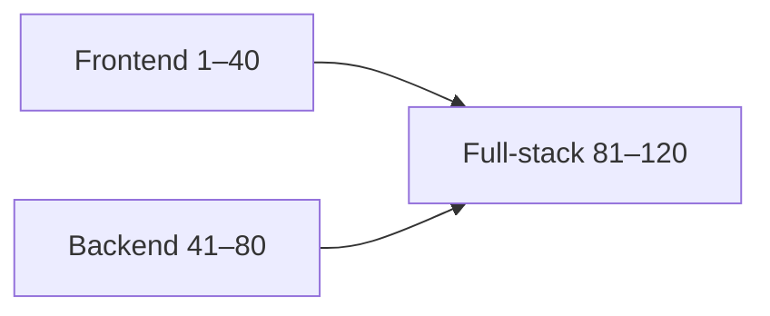

# Senior Interview Q&A

120 questions for mid → senior full-stack interviews. Each item has:

1. **Expected answer** — what a strong hire says
2. **Common wrong answer** — trap to avoid
3. **Follow-ups** — interviewer probes
4. **Trade-offs** — senior signal
5. **Production relevance** — why it matters on the job

## Tracks

| Range | Focus | File |
| --- | --- | --- |
| Q1–40 | Frontend (JS/React/Next/a11y/perf/security) | [01-frontend](/senior-qa/01-frontend) |
| Q41–80 | Backend (API/data/queues/ops/security) | [02-backend](/senior-qa/02-backend) |
| Q81–120 | Full-stack (auth, BFF, realtime, migrations) | [03-fullstack](/senior-qa/03-fullstack) |

## How to drill

1. Draw 10 random numbers; answer out loud in ≤2 minutes.
2. Only then read the expected answer and follow-ups.
3. Re-answer the follow-ups.

> [!TIP]
> Seniors narrate **trade-offs and failure modes**. Juniors list tools.
