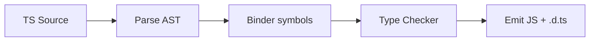
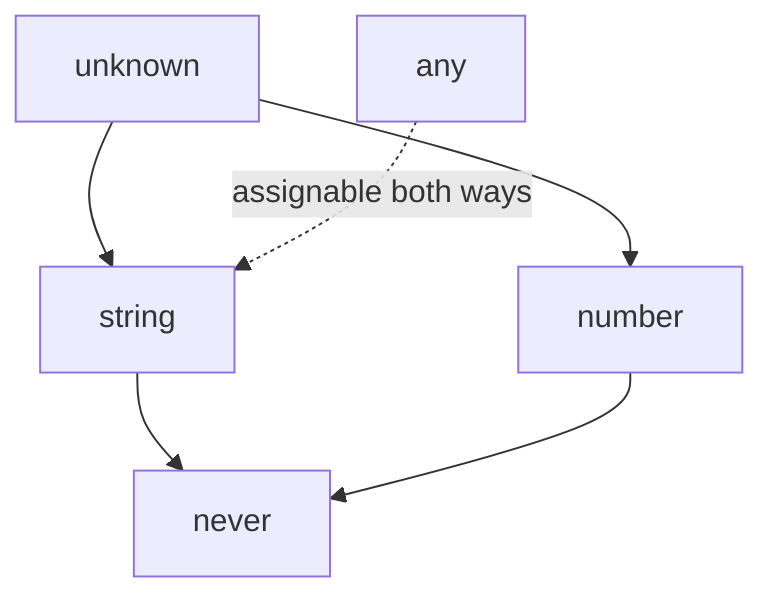

# Type System Internals

TypeScript’s type system is a **structural**, **gradual**, **erasable** static analysis layer over JavaScript. Types exist at compile time only (modulo `enum`/`namespace` emit and `experimentalDecorators` legacy). Interviews probe how checking actually works: assignability, widening, narrowing, freshness, and the relationship to runtime.

Related: [Structural Typing](/typescript/08-structural-typing) · [Variance](/typescript/09-variance) · [JS Fundamentals](/javascript/01-fundamentals) · [React + TS patterns](/react/03-hooks)

## Design axioms

| Axiom | Meaning |
| --- | --- |
| Erasable | `tsc` strips types; runtime is JS |
| Structural | Shape matters, not nominal `class` name (mostly) |
| Gradual | `any` / JS interop opt-out of checking |
| Soundness ≠ goal | Pragmatic unsound holes (`any`, excess property quirks, variance) |
| Bidirectional | Inference + annotation contexts |



## Type space vs value space

```ts
type User = { id: string } // type space
const User = { id: '1' }   // value space — same name OK (declaration merging-ish namespace)

type T = typeof User       // value → type
type Id = User['id']       // indexed access
```

`typeof` (TS) queries values; `keyof` queries keys; both are compile-time only. Runtime `typeof` is unrelated ([JS types](/javascript/01-fundamentals)).

## Top & bottom types

```ts
let a: any = 1           // top-ish opt-out; infects
let u: unknown = 1       // safe top — must narrow
let n: never = 0 as never // bottom — no values

function assertNever(x: never): never {
  throw new Error(`unexpected: ${x as string}`)
}
```



- `unknown` is the type-safe top: assignable **to** only `unknown`/`any` until narrowed.
- `any` disables checking; assignable to and from everything (poison).
- `never` is unreachable / empty set; used in exhaustiveness and filtered unions (`Exclude`).

## Widening & literal types

```ts
const x = 'hello'        // literal 'hello'
let y = 'hello'          // widened to string
const z = { k: 'hello' } // { k: string } — property widened

const z2 = { k: 'hello' } as const // { readonly k: 'hello' }
```

**Freshness (excess property check):** object **literals** assigned to types get extra-property errors; variables do not (structural openness).

```ts
type Opts = { a: number }
const ok = { a: 1, b: 2 }
const bad: Opts = { a: 1, b: 2 } // error — fresh literal
const fine: Opts = ok            // OK — excess allowed via variable
```

## Narrowing control flow

```ts
function print(id: string | number) {
  if (typeof id === 'string') {
    id.toUpperCase() // string
  } else {
    id.toFixed(0)    // number
  }
}

function isString(x: unknown): x is string {
  return typeof x === 'string'
}

// Discriminated unions
type Shape =
  | { kind: 'circle'; r: number }
  | { kind: 'square'; s: number }

function area(s: Shape): number {
  switch (s.kind) {
    case 'circle': return Math.PI * s.r ** 2
    case 'square': return s.s ** 2
    default: return assertNever(s)
  }
}
```

Narrowing operators: `typeof`, `instanceof`, `in`, equality, truthiness, discriminated tags, type predicates, `asserts`, assignment narrowing.

```ts
function assertDefined<T>(x: T | null | undefined): asserts x is T {
  if (x == null) throw new Error('undefined')
}
```

## Assignability (algorithm sketch)

Roughly: `S` assignable to `T` if for each required property of `T`, `S` has a compatible property; call signatures check contravariantly on params (with bivariant hack for methods — [Variance](/typescript/09-variance)); `any` short-circuits; enums have special numeric rules.

```ts
type A = { x: number; y: number }
type B = { x: number }
const b: B = { x: 1, y: 2 } as A // A assignable to B (extra props OK when not fresh)
```

## `strict` family (interview checklist)

| Flag | Effect |
| --- | --- |
| `strictNullChecks` | `null`/`undefined` not in every type |
| `strictFunctionTypes` | Contravariant function params for function syntax |
| `strictBindCallApply` | Typed `call`/`bind` |
| `noImplicitAny` | Error on implied `any` |
| `useUnknownInCatchVariables` | `catch (e)` is `unknown` |
| `noUncheckedIndexedAccess` | `obj[key]` adds `| undefined` |

## Ambient & erasure

```ts
declare function fetch(input: string): Promise<Response> // ambient — no emit

enum E { A, B } // emits runtime object (exception to pure erasure)
const enum CE { A, B } // inlines; avoid in libraries (isolatedModules)
```

Prefer `as const` objects + union types over enums in modern codebases ([Pitfalls](/typescript/10-pitfalls)).

## Interview Questions

**Q1. Is TypeScript sound?**  
No. Intentional holes: `any`, aliasing through mutable structures, bivariant methods historically, type assertions, `as any`. It’s about catching bugs pragmatically.

**Q2. `unknown` vs `any`?**  
Both accept any value. `unknown` forces narrowing before use; `any` does not.

**Q3. Why excess property checks only on literals?**  
Catch typos in config objects; still allow open structural assignability for non-fresh values.

**Q4. What does `asserts x is T` do?**  
Tells the checker that after the call, `x` is `T` or the function threw.

**Q5. Types at runtime?**  
Erased. Use values (`as const`, Zod, etc.) if you need runtime validation — common FE interview follow-up with forms/APIs.

## Common Mistakes

- Sprinkling `as` to silence errors instead of modeling unions.
- Using `any` in public library APIs.
- Confusing `typeof` operator (JS) with `typeof` type query.
- Expecting `enum` to be erasable / tree-shake friendly.
- Forgetting `strictNullChecks` off hides half the type system’s value.

## Trade-offs

| Choice | Pros | Cons |
| --- | --- | --- |
| `strict: true` | Real safety | Migration cost |
| Structural typing | JS-friendly | Accidental compatibility |
| Gradual `any` | Interop speed | Infects call graph |
| Assertions | Escape hatch | Lies to the compiler |
| Zod + inferred types | Runtime+static sync | Bundle / boilerplate |

**Senior takeaway:** Explain TS as a **compile-time constraint solver over JS shapes**, then dive into widening, freshness, and narrowing with a one-minute whiteboard example.

## Deep dive — bidirectional checking

TS checks in two modes: **synthesis** (infer type from expression) and **checking** (expression against contextual type). Contextual typing makes callbacks infer parameter types from the expected function type.

```ts
window.addEventListener('click', (e) => {
  // e inferred as MouseEvent from addEventListener overloads
})
const xs: Array<(n: number) => void> = [
  (n) => n.toFixed(0), // n contextual
]
```

## Deep dive — type relationships lattice

```ts
type Assert<T extends true> = T
type Eq<A, B> = [A] extends [B] ? ([B] extends [A] ? true : false) : false

type _1 = Assert<Eq<'a' | 'b', 'b' | 'a'>> // union order irrelevant
type _2 = Assert<'a' extends string ? true : false>
```

Use tuple wraps to avoid distributivity when testing equality.

## Deep dive — `const` type parameters (TS 5.0+)

```ts
function tuple<const T extends readonly unknown[]>(xs: T): T {
  return xs
}
const t = tuple([1, 'a']) // readonly [1, 'a']
```

Preserves literals without `as const` at call site — great for router path helpers ([Infer](/typescript/04-infer)).

## Extra Q&A

**Q6. Difference `interface` vs `type`?**  
Interfaces merge & are extendable; types can union/tuple/mapped more freely. Prefer interface for object shapes you may augment.

**Q7. What is a fresh object literal?**  
An object created inline in an assignment context — subject to excess property checks.

**Q8. `readonly` vs `as const`?**  
`readonly` on props; `as const` asserts deepest literals + readonly.

**Q9. Why `catch (e)` is `unknown` under strict?**  
Anything can be thrown — narrow before use ([Pitfalls](/typescript/10-pitfalls)).

**Q10. Ambient vs emitted?**  
`declare` adds types without JS; enums emit unless const enum inlined.


## Worked example — narrowing a form state machine

```ts
type FormState =
  | { status: 'idle' }
  | { status: 'submitting'; draft: string }
  | { status: 'error'; message: string }
  | { status: 'success'; id: string }

function message(s: FormState): string {
  switch (s.status) {
    case 'idle': return 'Ready'
    case 'submitting': return `Sending ${s.draft}`
    case 'error': return s.message
    case 'success': return s.id
    default: {
      const _exhaustive: never = s
      return _exhaustive
    }
  }
}
```

## Comparison — gradual vs sound

Sound systems reject more programs; TS accepts more JS patterns. Teams add Zod at boundaries to recover runtime soundness ([Pitfalls](/typescript/10-pitfalls)).

## Glossary

| Term | Definition |
| --- | --- |
| Erasure | Types removed at emit |
| Widening | Literal → general type |
| Narrowing | Union refined by control flow |
| Freshness | Excess property checking |
| Bottom type | `never` |


## Assignability cheat sheet

| From → To | Result |
| --- | --- |
| `string` → `string \| number` | OK |
| `string \| number` → `string` | Error |
| `any` → `string` | OK (unsafe) |
| `unknown` → `string` | Error |
| `never` → `string` | OK |
| `string` → `never` | Error |
| `{a:1,b:2}` literal → `{a:number}` | Excess check may fail |
| variable with extras → `{a:number}` | OK structurally |

## Control-flow analysis limits

TS does not deeply refine through closures captured before narrowing in all cases; re-narrow inside callbacks or use const locals. Discriminants must be known literals.

```ts
type Msg = { type: 'a'; a: number } | { type: 'b'; b: string }
function handle(m: Msg) {
  const t = m.type
  if (t === 'a') console.log(m.a) // works when discriminant aliased carefully in modern TS
}
```
