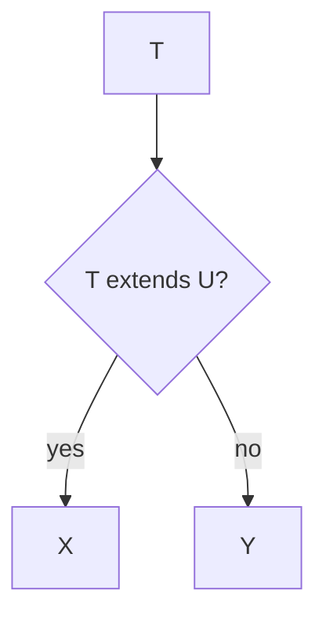

# Conditional Types

Conditional types express **type-level if/else**: `T extends U ? X : Y`. They power most of the standard library utilities and advanced inference. Combined with distribution over unions, they become a mini logic language.

Related: [Infer](/typescript/04-infer) · [Utility Types](/typescript/05-utility-types) · [Generics](/typescript/02-generics)

## Core syntax

```ts
type IsString<T> = T extends string ? true : false
type A = IsString<'a'>  // true
type B = IsString<1>    // false
```



Condition is checked by **assignability** of `T` to `U`, not runtime `instanceof`.

## Distributive conditional types

When the checked type is a **naked type parameter**, the conditional distributes over unions:

```ts
type ToArray<T> = T extends unknown ? T[] : never
type R = ToArray<string | number> // string[] | number[]
```

```mermaid
flowchart LR
  U[string or number] --> D1[string extends? → string[]]
  U --> D2[number extends? → number[]]
  D1 --> Out[string[] or number[]]
  D2 --> Out
```

**Disable distribution** by wrapping both sides in tuples:

```ts
type ToArrayNonDist<T> = [T] extends [unknown] ? T[] : never
type R2 = ToArrayNonDist<string | number> // (string | number)[]
```

This is the key trick behind filtering unions:

```ts
type Extract<T, U> = T extends U ? T : never
type Exclude<T, U> = T extends U ? never : T

type E = Extract<'a' | 'b' | 'c', 'a' | 'c'> // 'a' | 'c'
type F = Exclude<'a' | 'b' | 'c', 'a'>       // 'b' | 'c'
```

`never` in unions disappears (`A | never` → `A`).

## Nested conditionals & patterns

```ts
type TypeName<T> =
  T extends string ? 'string' :
  T extends number ? 'number' :
  T extends boolean ? 'boolean' :
  T extends undefined ? 'undefined' :
  T extends Function ? 'function' :
  'object'

type Flatten<T> = T extends (infer U)[] ? Flatten<U> : T
type Nested = Flatten<number[][][]> // number
```

`infer` is covered deeply in [Infer](/typescript/04-infer); it only appears in the `extends` clause’s true branch pattern.

## `extends` quirks with `any` / `never`

```ts
type T1 = any extends string ? 1 : 2     // 1 | 2 — any distributes oddly
type T2 = never extends string ? 1 : 2   // 1 — never extends everything
type T3 = string extends never ? 1 : 2   // 2
```

`never` is assignable to every type; every type is assignable to `unknown`. Filtering empty:

```ts
type NonNullable<T> = T extends null | undefined ? never : T
```

## Template literal + conditional

```ts
type EventName<T extends string> = `on${Capitalize<T>}`
type Handler<T extends string> = T extends EventName<infer E>
  ? (event: E) => void
  : never
```

## Mapped + conditional (key remapping)

```ts
type Functions<T> = {
  [K in keyof T as T[K] extends (...args: never[]) => unknown ? K : never]: T[K]
}

type Api = {
  get: () => void
  url: string
  post: (b: string) => void
}
type OnlyFns = Functions<Api> // { get: ...; post: ... }
```

## Variance interaction

```ts
type Foo<T> = T extends string ? string : number
// Foo is not a simple variant functor — depends on branch
```

Prefer documenting distributive behavior in public types — surprising for consumers.

## Interview Questions

**Q1. Why does `T extends X ? A : B` split unions?**  
Naked type parameter distribution — designed so `Exclude`/`Extract` work element-wise.

**Q2. How to prevent distribution?**  
Wrap: `[T] extends [X] ? ...`.

**Q3. Implement `NonNullable`.**  
`T extends null | undefined ? never : T`.

**Q4. Difference between `T extends any` and `T extends unknown`?**  
Both distribute; historically used to force distribution. Prefer clear named helpers.

**Q5. Why `never` for filtered keys?**  
In unions and in key remapping (`as never`), `never` removes members/keys.

## Common Mistakes

- Forgetting distribution and wondering why `T[]` became a union of arrays.
- Writing conditionals where a mapped type or simple intersection works.
- Using `any` in extends clauses accidentally widening.
- Deep recursive conditionals without termination → compiler CPU melt.
- Confusing runtime control flow with type conditionals.

## Trade-offs

| Technique | Pros | Cons |
| --- | --- | --- |
| Distributive conditionals | Elegant union transforms | Surprising |
| Tuple-wrapped non-distrib | Predictable | Verbose |
| Recursive conditionals | Powerful parsing | Slow / depth limits |
| Overloads | Clear DX | Less composable |

**Senior takeaway:** Conditional types = **assignability tests + distribution**. Master `Exclude`/`Extract` mentally and you can derive half the utility types live.

## Deep dive — distributive filtering patterns

```ts
type FunctionPropertyNames<T> = {
  [K in keyof T]: T[K] extends (...args: never[]) => unknown ? K : never
}[keyof T]

type FunctionProperties<T> = Pick<T, FunctionPropertyNames<T>>
```

Union of keys via indexed access `[keyof T]` collapses `never`.

## Deep dive — `infer` + distribute

```ts
type UnwrapAll<T> = T extends Promise<infer U> ? UnwrapAll<U> : T
type UnionOfArrays<T> = T extends unknown ? T[] : never
// string | number → string[] | number[]
```

## Deep dive — compile-time cost

Deep recursive conditionals on large unions (e.g. route string parsers over hundreds of routes) slow the language service. Cap recursion; prefer codegen for huge surfaces ([Module resolution](/typescript/07-module-resolution) monorepos).

## Extra Q&A

**Q6. Does `T extends any` distribute?**  
Yes — classic force-distribute trick.

**Q7. `never extends never`?**  
`true` — never extends everything including never.

**Q8. Filter `null` from union?**  
`NonNullable<T>` or `Exclude<T, null | undefined>`.

**Q9. Conditional vs overload DX?**  
Overloads show clearer IntelliSense for finite cases; conditionals compose better.

**Q10. `assertNever` with conditionals?**  
Exhaustiveness still uses `never` at value level after narrowing.


## Worked example — API method extractor

```ts
type Methods<T> = {
  [K in keyof T]: T[K] extends (...args: never[]) => unknown ? K : never
}[keyof T]
type OnlyMethods = Methods<{ a: 1; b: () => void; c: (x: string) => number }>
// 'b' | 'c'
```

## Relation to Prolog / pattern match

Conditional types ≈ compile-time pattern match on assignability; distribution ≈ map over union alternatives.

## Glossary

| Term | Definition |
| --- | --- |
| Distributive | Applies per union member |
| Naked parameter | Unwrapped `T` in check position |
| `never` filter | Drops from unions/keys |
| Instantiation depth | Recursion limit |


## Building `OptionalKeys` / `RequiredKeys`

```ts
type OptionalKeys<T> = {
  [K in keyof T]-?: {} extends Pick<T, K> ? K : never
}[keyof T]
type RequiredKeys<T> = Exclude<keyof T, OptionalKeys<T>>
type O = OptionalKeys<{ a: string; b?: number }> // 'b'
```

Classic interview derivation using conditional + empty object assignability.
