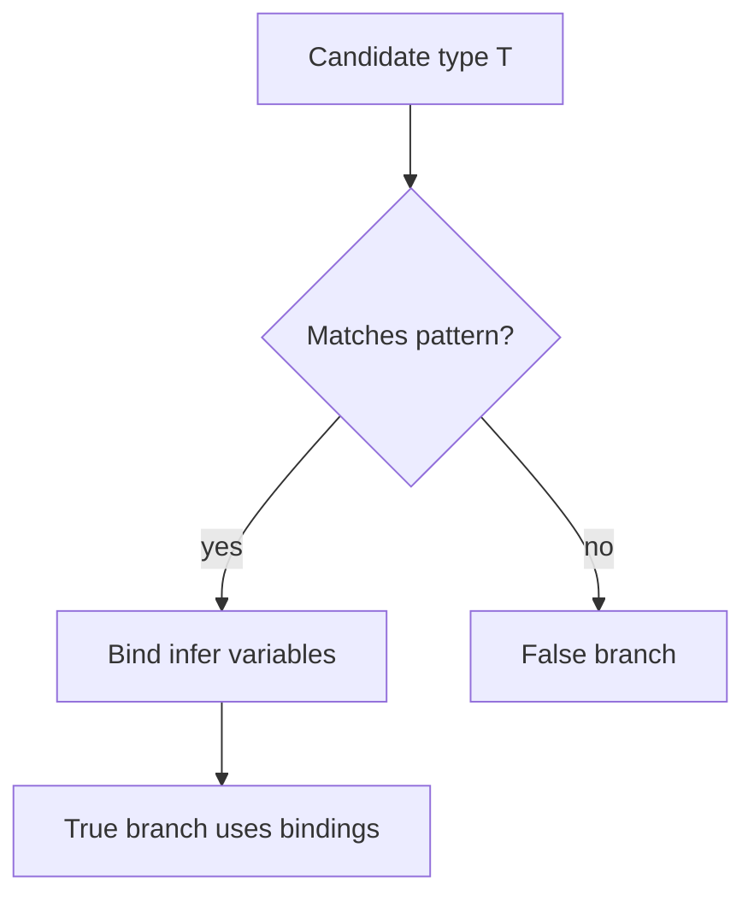

# Infer

`infer` introduces a **type variable inside a conditional type’s `extends` clause**, binding a pattern match result for use in the true branch. It’s how you extract return types, parameter types, promise payloads, and tuple elements.

Related: [Conditional Types](/typescript/03-conditional-types) · [Utility Types](/typescript/05-utility-types) · [Generics](/typescript/02-generics)

## Mental model

```ts
type ReturnType<T> = T extends (...args: never[]) => infer R ? R : never

type A = ReturnType<() => string>           // string
type B = ReturnType<(x: number) => boolean> // boolean
type C = ReturnType<string>                 // never
```



`infer R` is only valid in the **extends type position** of a conditional, not in arbitrary type aliases alone.

## Standard library extractions via infer

```ts
type Parameters<T> = T extends (...args: infer P) => unknown ? P : never
type ConstructorParameters<T> = T extends abstract new (...args: infer P) => unknown
  ? P
  : never
type InstanceType<T> = T extends abstract new (...args: never[]) => infer R ? R : never
type Awaited<T> = T extends null | undefined
  ? T
  : T extends object & { then(onfulfilled: infer F, ...args: infer _): any }
    ? F extends (value: infer V, ...args: infer _) => any
      ? Awaited<V>
      : never
    : T
```

```ts
type P = Parameters<(a: string, b: number) => void> // [string, number]
type I = Awaited<Promise<Promise<string>>>          // string
```

## Multiple `infer` positions

```ts
type FirstArg<T> = T extends (a: infer A, ...rest: never[]) => unknown ? A : never
type Element<T> = T extends (infer U)[] ? U : never
type Head<T> = T extends [infer H, ...unknown[]] ? H : never
type Tail<T> = T extends [unknown, ...infer R] ? R : never
type Last<T> = T extends [...unknown[], infer L] ? L : never
```

Tuple patterns with rest are interview favorites:

```ts
type Cons<H, T extends unknown[]> = [H, ...T]
type Push<T extends unknown[], V> = [...T, V]
```

## Infer with constraints (TS 4.7+)

```ts
type FirstString<T> = T extends [infer S extends string, ...unknown[]] ? S : never
type Ok = FirstString<['a', 1]>  // 'a'
type Bad = FirstString<[1, 'a']> // never
```

Constraint on infer fails the match if unsatisfied (goes to false branch).

## Template literal inference

```ts
type Parse<T extends string> =
  T extends `${infer Head}:${infer Rest}` ? [Head, Rest] : never

type R = Parse<'user:42'> // ['user', '42']

type RouteParams<T extends string> =
  T extends `${string}:${infer P}/${infer Rest}`
    ? P | RouteParams<Rest>
    : T extends `${string}:${infer P}`
      ? P
      : never

type Params = RouteParams<'/users/:id/posts/:postId'> // 'id' | 'postId'
```

Useful for typed routers (Next.js App Router params — [Next App Router](/nextjs/01-app-router)).

## Covariance of infer positions (intuition)

Where you `infer` matters for what gets matched:

```ts
type Foo<T> = T extends { a: infer U; b: infer U } ? U : never
type X = Foo<{ a: string; b: number }> // string | number — U becomes union of matches
```

Same infer name in multiple spots → union (or intersection in contravariant positions — advanced corner).

```ts
type Bar<T> = T extends (x: infer U) => void ? U : never
// function param position is contravariant — intersections can appear in some dual patterns
```

## Recursive inference patterns

```ts
type DeepReadonly<T> = T extends (...args: never[]) => unknown
  ? T
  : T extends object
    ? { readonly [K in keyof T]: DeepReadonly<T[K]> }
    : T

type Json =
  | string
  | number
  | boolean
  | null
  | { [k: string]: Json }
  | Json[]
```

Careful with recursion depth limits on huge types.

## Interview Questions

**Q1. Implement `ReturnType`.**  
`T extends (...args: any) => infer R ? R : never` (prefer `never[]` / `unknown` over `any` for params).

**Q2. Why can’t I `infer` outside conditional?**  
`infer` is a binding construct for pattern matching in `extends`, not a general “declare type var”.

**Q3. Extract Promise value type?**  
`T extends Promise<infer U> ? U : T` or use `Awaited<T>`.

**Q4. Difference between `infer U` and type parameter `<U>`?**  
`<U>` is declared at alias/function scope and chosen by inference/args. `infer U` is bound by matching a structure inside a conditional.

**Q5. How does `Parameters` preserve tuple labels?**  
TS preserves parameter name labels in tuple types from function types — useful for DX.

## Common Mistakes

- Writing `infer R` in the false branch or outside `extends`.
- Using `any` in patterns when `unknown`/`never[]` works.
- Forgetting distribution: `ReturnType` on union of functions distributes.
- Over-recursive string parsers that freeze the IDE.
- Matching `object` too greedily (functions/arrays are objects).

## Trade-offs

| Pattern | Pros | Cons |
| --- | --- | --- |
| `infer` utilities | Zero runtime; compose | Opaque error messages |
| Runtime Zod parsers | Actual validation | Dup schema / cost |
| Manual overloads | Clear | Verbose |
| Codegen from OpenAPI | Accurate | Pipeline complexity |

**Senior takeaway:** Treat `infer` as **destructuring for types**. If you can write the value-level destructure, you can usually write the `infer` pattern.

## Deep dive — function variance positions with infer

```ts
type PropsIn<T> = T extends React.ComponentType<infer P> ? P : never
// conceptual — extract props from a component type
```

Cross-link: [React](/react/03-hooks) component typing.

## Deep dive — string splitting utilities

```ts
type Split<S extends string, D extends string> =
  S extends `${infer H}${D}${infer R}` ? [H, ...Split<R, D>] : [S]

type Parts = Split<'a.b.c', '.'> // ['a','b','c']
```

## Deep dive — this-parameters

```ts
type ThisParam<T> = T extends (this: infer U, ...args: never[]) => unknown ? U : unknown
```

Rare but shows up in method extraction interviews.

## Extra Q&A

**Q6. Can you `infer` in interfaces?**  
Only inside conditional types used by the interface/aliases.

**Q7. `infer` with rest tuples?**  
`[...infer Init, infer Last]` patterns (TS 4.0+).

**Q8. Why `never[]` in `Parameters` style?**  
Avoids `any` while accepting any arity in the pattern.

**Q9. Extract mixin return?**  
Infer from intersection of constructors — advanced class mixin patterns.

**Q10. Failure mode of recursive Split?**  
Huge strings → instantiation depth errors; bound depth.


## Worked example — middleware `Next` type

```ts
type Middleware = (req: Request, next: () => Promise<Response>) => Promise<Response>
type NextOf<T> = T extends (req: any, next: infer N) => any ? N : never
type N = NextOf<Middleware> // () => Promise<Response>
```

## Infer in React prop helpers

`React.ComponentProps<typeof Button>` is library sugar over infer-like patterns — use it instead of hand-rolling ([React](/react/03-hooks)).

## Glossary

| Term | Definition |
| --- | --- |
| `infer` | Bind variable in pattern |
| Pattern | `extends` right-hand shape |
| Tuple rest | `...infer R` |
| Constrained infer | `infer X extends Y` |


## Curry inference sketch

```ts
type Curry<F> = F extends (a: infer A, b: infer B) => infer R
  ? (a: A) => (b: B) => R
  : never
type C = Curry<(a: string, b: number) => boolean>
// (a: string) => (b: number) => boolean
```

Shows multiple `infer` bindings in one signature pattern.
