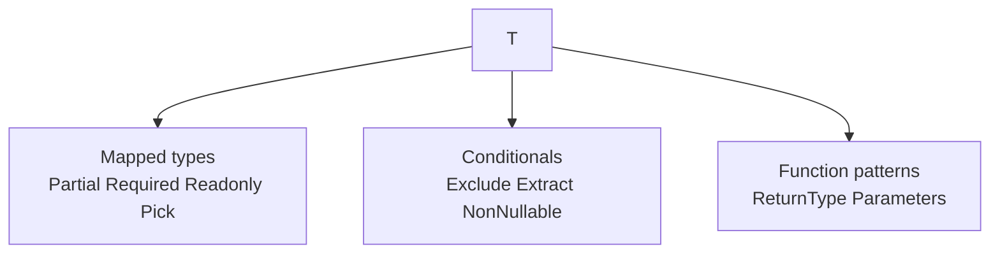

# Utility Types

TypeScript’s built-in utilities are thin aliases over mapped types, conditionals, and `infer`. Interviews expect you to **reimplement** the common ones from scratch — that proves understanding.

Related: [Conditional Types](/typescript/03-conditional-types) · [Infer](/typescript/04-infer) · [Structural Typing](/typescript/08-structural-typing)

## Catalog (must-know)

| Utility | Meaning |
| --- | --- |
| `Partial<T>` | All props optional |
| `Required<T>` | All props required |
| `Readonly<T>` | All props readonly |
| `Pick<T, K>` | Subset of props |
| `Omit<T, K>` | Opposite of Pick |
| `Record<K, V>` | Key→value map type |
| `Exclude<T, U>` | Remove from union |
| `Extract<T, U>` | Keep from union |
| `NonNullable<T>` | Drop null/undefined |
| `ReturnType` / `Parameters` | From function types |
| `InstanceType` | From constructor |
| `Awaited<T>` | Unwrap promises |



## Reimplementations (interview gold)

```ts
type MyPartial<T> = { [K in keyof T]?: T[K] }
type MyRequired<T> = { [K in keyof T]-?: T[K] }
type MyReadonly<T> = { readonly [K in keyof T]: T[K] }

type MyPick<T, K extends keyof T> = { [P in K]: T[P] }
type MyOmit<T, K extends keyof any> = MyPick<T, Exclude<keyof T, K>>

type MyRecord<K extends keyof any, T> = { [P in K]: T }

type MyExclude<T, U> = T extends U ? never : T
type MyExtract<T, U> = T extends U ? T : never
type MyNonNullable<T> = T extends null | undefined ? never : T

type MyReturnType<T> = T extends (...args: never[]) => infer R ? R : never
type MyParameters<T> = T extends (...args: infer P) => unknown ? P : never
```

Modifiers: `+`/`-` on `?` and `readonly` in mapped types (`-?` removes optionality).

## Key remapping (TS 4.1+)

```ts
type Getters<T> = {
  [K in keyof T as `get${Capitalize<string & K>}`]: () => T[K]
}

type Id = Getters<{ name: string; age: number }>
// { getName: () => string; getAge: () => number }

type Public<T> = {
  [K in keyof T as K extends `_${string}` ? never : K]: T[K]
}
```

## `Pick` vs `Omit` vs intersection tricks

```ts
type User = { id: string; name: string; password: string }
type Safe = Omit<User, 'password'>
type Safe2 = Pick<User, 'id' | 'name'>

// Merge / override pattern
type Override<A, B> = Omit<A, keyof B> & B
type Props = Override<{ a: string; b: number }, { b: string }>
// { a: string } & { b: string }
```

Prefer `Override` helpers carefully — intersections of conflicting props become `never` in value positions sometimes via excess checks.

## `Readonly` / `Partial` deep variants

```ts
type DeepPartial<T> = {
  [K in keyof T]?: T[K] extends object ? DeepPartial<T[K]> : T[K]
}

type DeepReadonly<T> = {
  readonly [K in keyof T]: T[K] extends (...args: never[]) => unknown
    ? T[K]
    : T[K] extends object
      ? DeepReadonly<T[K]>
      : T[K]
}
```

Built-ins are **shallow** — call this out in interviews.

## `Record` pitfalls

```ts
type Flags = Record<string, boolean>
const f: Flags = { a: true }
f.nope // boolean — no error! index signature

type StrictFlags = Record<'a' | 'b', boolean>
const s: StrictFlags = { a: true, b: false }
```

With `noUncheckedIndexedAccess`, `f[key]` is `boolean | undefined`.

## Satisfies + utilities

```ts
type Config = Record<string, string | number>
const cfg = {
  port: 3000,
  host: 'localhost',
} as const satisfies Config
// preserve literals while checking assignability
```

## Interview Questions

**Q1. Implement `Omit`.**  
`Pick<T, Exclude<keyof T, K>>`.

**Q2. Why is `Partial` shallow?**  
Mapped type only wraps top-level keys; nested objects keep required fields.

**Q3. `Exclude` vs `Omit`?**  
`Exclude` = unions; `Omit` = object keys.

**Q4. Difference `Pick` and destructuring types?**  
`Pick` builds an object type; `keyof`/`T[K]` pull members. Related but not identical.

**Q5. How does `Required` interact with `?` and `undefined`?**  
`-?` makes property required; under `exactOptionalPropertyTypes`, `undefined` assignability differs from missing key.

## Common Mistakes

- Using `Omit` on unions incorrectly (distributes poorly — prefer helper that maps over union).
- `Record<string, T>` losing key safety.
- Assuming deep immutability from `Readonly`.
- `ReturnType` of generic functions without specifying args → often wrong/`unknown`.
- Duplicating utilities instead of composing (`Omit` + `Partial`).

## Trade-offs

| Helper style | Pros | Cons |
| --- | --- | --- |
| Built-in utils | Familiar | Shallow / limited |
| Custom deep utils | Powerful | Compile-time cost, opacity |
| Runtime validation | Correctness | Bundle size |
| Codegen | Accurate API types | Tooling |

**Senior takeaway:** Don’t memorize names only — **derive** `Partial`/`Pick`/`Exclude` on a whiteboard in under a minute.

## Deep dive — `Omit` on unions (pitfall)

```ts
type A = { type: 'a'; a: number; shared: string }
type B = { type: 'b'; b: boolean; shared: string }
type U = A | B
type Bad = Omit<U, 'shared'> // distributes poorly / unexpected
type Good = U extends infer X ? Omit<X, 'shared'> : never
// or map: A and B separately
```

Prefer distributive helpers for union objects.

## Deep dive — `ThisType` & `ReturnType` of generics

```ts
function id<T>(x: T): T {
  return x
}
type R = ReturnType<typeof id> // unknown — generic not instantiated
type R2 = ReturnType<typeof id<string>> // string (TS 4.7+)
```

## Deep dive — template utilities

```ts
type Camel<S extends string> = S extends `${infer H}_${infer T}`
  ? `${H}${Capitalize<Camel<T>>}`
  : S
type C = Camel<'hello_world_case'> // helloWorldCase
```

## Extra Q&A

**Q6. `Record<never, V>`?**  
Empty object type-ish; used in conditional empties.

**Q7. `Uppercase`/`Lowercase` intrinsic?**  
Compiler intrinsics — not user-reimplementable the same way.

**Q8. Why reimplement utils in interviews?**  
Proves mapped + conditional mastery.

**Q9. `Pick` optional props?**  
Keeps optionality modifiers from source.

**Q10. Combine `Readonly` + `Partial`?**  
`Readonly<Partial<T>>` — order matters for readability only; both apply.


## Worked example — mutate nested config type

```ts
type AppConfig = {
  api: { baseUrl: string; retries: number }
  flags: { beta: boolean }
}
type Patch = DeepPartial<AppConfig>
// allow { api?: { retries?: number } }
```

## `Pick` performance tip

Prefer `Pick` over repeating fields — single source of truth when props subset of model.

## Glossary

| Term | Definition |
| --- | --- |
| Mapped type | `{ [K in ...] }` |
| Modifier | `readonly` / `?` / `-?` |
| Intrinsic | `Uppercase` etc. |
| Key remapping | `as NewKey` |


## `UnionToIntersection` (advanced)

```ts
type UnionToIntersection<U> =
  (U extends unknown ? (k: U) => void : never) extends (k: infer I) => void ? I : never
type I = UnionToIntersection<{ a: 1 } | { b: 2 }> // { a: 1 } & { b: 2 }
```

Uses contravariant infer position — strong senior signal ([Variance](/typescript/09-variance)).
