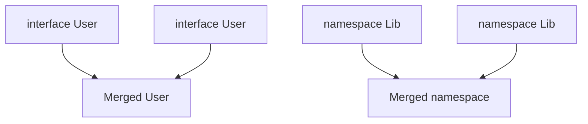

# Declaration Merging

Declaration merging combines multiple declarations with the same name into one definition. It enables **augmentation** of modules, globals, and interfaces — essential for DefinitelyTyped and plugin APIs.

Related: [Module Resolution](/typescript/07-module-resolution) · [Type System](/typescript/01-type-system) · [JS Modules](/javascript/13-modules)

## What merges

| Declaration | Merges with |
| --- | --- |
| `interface` | Other `interface`s (same name) |
| `namespace` | Other `namespace`s; also with values/classes/fns (value+type) |
| `enum` | Other `enum`s (same name) |
| `type` alias | **Never** merges |
| `class` | Interfaces of same name (types only); not two classes |



## Interface merging

```ts
interface Box {
  height: number
}
interface Box {
  width: number
}
const b: Box = { height: 1, width: 2 }

// Methods with same name → overloads in declaration order
interface Doc {
  createElement(tag: 'canvas'): HTMLCanvasElement
}
interface Doc {
  createElement(tag: 'div'): HTMLDivElement
}
interface Doc {
  createElement(tag: string): Element
}
```

Non-function members of the same name must have **identical** types or error.

## Module augmentation

```ts
// app.d.ts or ambient module
import 'express'

declare module 'express-serve-static-core' {
  interface Request {
    userId?: string
  }
}

// usage
import type { Request } from 'express'
function h(req: Request) {
  console.log(req.userId)
}
```

```ts
// Augmenting your own module
// colors.ts
export interface Palette {
  primary: string
}
// theme.ts
declare module './colors' {
  interface Palette {
    secondary: string
  }
}
```

Must be in a **module** (has import/export) or proper ambient context. `export {}` forces file-as-module.

## Global augmentation

```ts
export {} // ensure module

declare global {
  interface Window {
    __APP_VERSION__: string
  }
  type MyGlobal = { x: number }
}

window.__APP_VERSION__ = '1.0.0'
```

Common for analytics SDKs, feature flags on `Window`. Prefer explicit imports over globals when possible.

## Namespace merging with values

```ts
class Album {
  label!: Album.AlbumLabel
}
namespace Album {
  export class AlbumLabel {}
}
// Album is both constructor value and namespace
```

Function + namespace pattern (legacy, still in TS libs):

```ts
function exp(x: number) {
  return Math.exp(x)
}
namespace exp {
  export const e = Math.E
}
exp.e
```

## Enum merging

```ts
enum Direction {
  Up = 1,
}
enum Direction {
  Down = 2, // must initialize if previous had initializer mix rules
}
```

Const enums don’t merge usefully across files under `isolatedModules`.

## Interface + class

```ts
interface Person {
  name: string
}
class Person {
  age = 0
}
// Instance type of class merges with interface → need name & age
const p: Person = { name: 'a', age: 1 } // structural
new Person() // age only at runtime unless assigned
```

Careful: this confuses value vs type spaces.

## Interview Questions

**Q1. Can `type` aliases merge?**  
No. Use `interface` when you need augmentation.

**Q2. Why prefer `interface` for public object types in libs?**  
Consumers can augment; `type` cannot. Also slightly better error caching historically.

**Q3. How do you type `req.user` in Express?**  
Module augmentation on Express’s `Request` interface.

**Q4. `declare module '*.css'` purpose?**  
Ambient module declaration for non-TS imports — bundler handles runtime.

```ts
declare module '*.module.css' {
  const classes: { readonly [key: string]: string }
  export default classes
}
```

**Q5. Risks of global augmentation?**  
Name collisions, hidden dependencies, harder testing, broken under different lib DOMs.

## Common Mistakes

- Trying to merge `type` aliases.
- Augmenting wrong module name (`express` vs `express-serve-static-core`).
- Forgetting `export {}` → script vs module scope.
- Conflicting property types in merged interfaces.
- Relying on namespace patterns in modern ESM-first code.

## Trade-offs

| Mechanism | Pros | Cons |
| --- | --- | --- |
| Interface merge | Open for extension | Surprise shape growth |
| Module augmentation | Plugin DX | Fragile to upstream renames |
| Globals | Convenient | Implicit coupling |
| Wrapper types | Explicit | Verbose plumbing |

**Senior takeaway:** Use merging for **intentional extension points**; prefer composition/`type` for app domain models you fully control.

## Deep dive — augmenting JSX

```ts
declare namespace React {
  interface HTMLAttributes<T> {
    'data-testid'?: string
  }
}
```

Or via module augmentation of React types — keep versions aligned ([React](/react/12-interview-qa)).

## Deep dive — plugin registration pattern

```ts
interface PluginRegistry {}
type Register<T extends string, P> = {
  // consumers merge into PluginRegistry
}
declare module './registry' {
  interface PluginRegistry {
    analytics: { track(e: string): void }
  }
}
```

## Deep dive — conflicting merges

Identical property names must match. Method overloads concatenate. Optional vs required conflicts error. Fix by renaming or wrapping types.

## Extra Q&A

**Q6. Can namespaces merge across packages?**  
Yes if same global/module name — collision risk.

**Q7. `export as namespace`?**  
UMD/global hybrid emit for libraries — legacy.

**Q8. Augment vs wrapper type?**  
Augment mutates world; wrapper is local and safer for apps.

**Q9. Why `export {}` in ambient files?**  
Ensures file is a module so `declare global` works.

**Q10. Triple-slash references?**  
Legacy dependency hints; prefer project references / imports.


## Worked example — Jest matcher augmentation

```ts
declare global {
  namespace jest {
    interface Matchers<R> {
      toBeWithinRange(a: number, b: number): R
    }
  }
}
export {}
```

## When not to merge

App domain `User` type that changes weekly — use `type` aliases and versioned API types, not open interfaces.

## Glossary

| Term | Definition |
| --- | --- |
| Augmentation | Add to existing module types |
| Ambient | Declare without implementation |
| Merge | Combine same-named declarations |
| Global | Available without import |


## DefinitelyTyped contribution mental model

`@types/foo` is ambient module declarations. Versioning tracks major of library. Augment carefully; prefer shipping types in the library (`types` in package.json) ([Module resolution](/typescript/07-module-resolution)).
