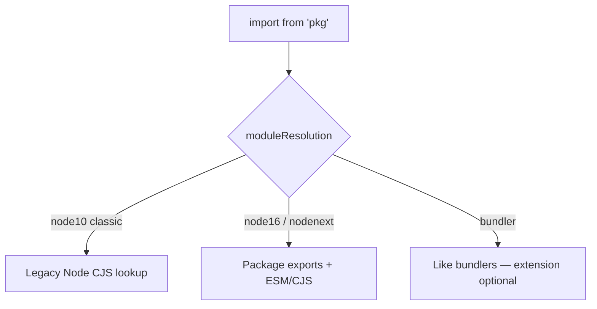

# Module Resolution

Module resolution is how TypeScript maps `import './x'` / `import 'lodash'` to a file (and its types). Wrong config causes the classic “works in Vite, fails in `tsc`” interview story.

Related: [Declaration Merging](/typescript/06-declaration-merging) · [JS Modules](/javascript/13-modules) · [Next.js](/nextjs/01-app-router) · [Pitfalls](/typescript/10-pitfalls)

## Classic vs Node vs Bundler



| `moduleResolution` | Use when |
| --- | --- |
| `node` / `node10` | Legacy; avoid new projects |
| `node16` / `nodenext` | Native Node ESM — respects `exports`, requires extensions in relative ESM |
| `bundler` | Vite/Webpack/esbuild apps — modern default with `module: esnext` |

```json
{
  "compilerOptions": {
    "module": "ESNext",
    "moduleResolution": "Bundler",
    "resolveJsonModule": true,
    "esModuleInterop": true,
    "isolatedModules": true,
    "verbatimModuleSyntax": true
  }
}
```

## Lookup algorithm (simplified Node)

For `import from 'foo'`:

1. Check `node_modules/foo/package.json` → `types`/`typings`/`exports` conditions (`types`, `import`, `require`).
2. Else `foo.d.ts`, `foo/index.d.ts`.
3. Walk parent `node_modules`.
4. `@types/foo` if package ships no types.

Relative `./bar`: try `bar.ts`, `bar.tsx`, `bar.d.ts`, `bar/index.ts`, … (exact set depends on mode / `allowImportingTsExtensions`).

## `paths` & `baseUrl`

```json
{
  "compilerOptions": {
    "baseUrl": ".",
    "paths": {
      "@/*": ["src/*"]
    }
  }
}
```

**Critical:** `paths` is **TypeScript-only** unless the bundler/runtime mirrors it (Vite `resolve.alias`, Next `jsconfig`/`tsconfig` paths). Node won’t understand `@/` without a loader.

## ESM / CJS interop

```ts
import fs from 'fs'           // needs esModuleInterop / NodeNext rules
import * as fs2 from 'fs'
import pkg from 'pkg'         // depends on module.exports vs export default
```

| Flag | Effect |
| --- | --- |
| `esModuleInterop` | Synthetic default import helpers |
| `allowSyntheticDefaultImports` | Type-only allowance for default |
| `verbatimModuleSyntax` | Force `import type` / correct emit |

```ts
import type { Request } from 'express' // erased entirely
import { type Request2, app } from './mod' // inline type modifier
```

## `package.json` `exports` & `types`

```json
{
  "name": "my-lib",
  "type": "module",
  "exports": {
    ".": {
      "types": "./dist/index.d.ts",
      "import": "./dist/index.js"
    },
    "./plugin": {
      "types": "./dist/plugin.d.ts",
      "import": "./dist/plugin.js"
    }
  }
}
```

Deep imports blocked if not exported — intentional encapsulation. Dual packages need careful `require`/`import` conditions.

## Declaration emit & project references

```json
{
  "compilerOptions": {
    "declaration": true,
    "declarationMap": true,
    "composite": true
  },
  "references": [{ "path": "../core" }]
}
```

Monorepos: project references build dependency graph for `tsc -b`. Types resolve to `.d.ts` outputs.

## Ambient modules vs real modules

```ts
declare module 'untyped-lib'
declare module 'untyped-lib' {
  export function doThing(): void
}
```

Tripleslash / `@types` / shipping `index.d.ts` — prefer official types.

## Interview Questions

**Q1. Why does Vite resolve `@/` but `tsc` fails?**  
Missing `paths` in tsconfig or running `tsc` without the same config the IDE uses.

**Q2. `moduleResolution: bundler` vs `nodenext`?**  
Bundler: app code with extensionless imports. NodeNext: libraries/runtime Node ESM correctness (extensions, exports).

**Q3. What is `isolatedModules`?**  
Each file must be compilable alone (babel/esbuild). Bans const enum cross-file, re-export type without `import type`, etc.

**Q4. How does TS find React types?**  
`@types/react` in node_modules via DefinitelyTyped unless React ships types (modern React does for some entrypoints — still often `@types`).

**Q5. `skipLibCheck`?**  
Skip typechecking of all `.d.ts` — faster CI; can hide errors in dependencies.

## Common Mistakes

- Assuming `paths` rewrites runtime imports.
- Mixing `CommonJS` `module` with ESM syntax randomly.
- Forgetting `.js` extensions under `nodenext` relative imports (TS path maps to `.ts` source).
- Publishing package without `exports.types`.
- Dual package hazard (CJS/ESM mismatch).

## Trade-offs

| Setting | Pros | Cons |
| --- | --- | --- |
| `bundler` | DX with Vite | Not equal to Node runtime |
| `nodenext` | Correct Node ESM | Verbose extensions |
| `skipLibCheck` | Speed | Missed dep errors |
| `paths` aliases | Clean imports | Dual config with bundler |
| Project references | Incremental monorepo | Setup complexity |

**Senior takeaway:** Separate **type resolver** from **runtime resolver**, and make them agree — that’s most “TS module” production pain.

## Deep dive — `exports` conditions order

Resolvers pick conditions based on mode (`import`, `require`, `types`, `browser`, `default`). Wrong order in `package.json` breaks consumers. Always put `types` alongside each entry condition.

## Deep dive — extension rewrite under NodeNext

```ts
// source: foo.ts
import { bar } from './bar.js' // points to bar.ts in resolution
```

Emit keeps `.js` for runtime ESM. Confusing but correct.

## Deep dive — Vite + TS

Vite uses esbuild/SWC transpile without full typecheck — run `tsc --noEmit` in CI. Aliases in both `vite.config` and `tsconfig.paths`. → [Pitfalls](/typescript/10-pitfalls)

## Extra Q&A

**Q6. `typesVersions`?**  
Map TS version → type entrypoints for older compilers.

**Q7. Why `allowImportingTsExtensions`?**  
Bundler mode with `.ts` imports rewritten by bundler — not for raw Node.

**Q8. Resolution of `index`?**  
Directory index files still apply depending on mode.

**Q9. Peer dependency types?**  
`@types/react` as peer — duplicate versions cause incompatible JSX namespaces.

**Q10. `customConditions`?**  
TS 5.0+ custom export conditions matching bundler defines.


## Worked example — “Cannot find module @/utils”

Checklist: `paths` in tsconfig used by IDE? Vite alias set? `tsc` run with same config? CI using root tsconfig? Fix all three.

## Publishing library checklist

1. `exports` with `types` + `import`.  
2. `declaration: true`.  
3. Avoid path aliases in published `.d.ts` (or rewrite).  
4. `sideEffects` for bundlers.  
5. Test in consumer package with `nodenext` and `bundler`.

## Glossary

| Term | Definition |
| --- | --- |
| `exports` | package.json entry map |
| Dual package | CJS+ESM ship |
| Project reference | `tsc -b` composite project |
| `skipLibCheck` | Skip `.d.ts` checking |
| `verbatimModuleSyntax` | Enforce type import syntax |


## Monorepo `references` graph

```text
apps/web  → packages/ui → packages/types
apps/api  → packages/types
```

`tsc -b` builds dependents in order. Types resolve to composite `dist` declarations — faster than one giant project.
