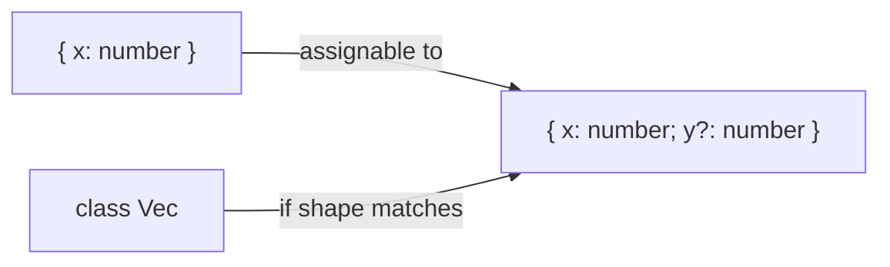

# Structural Typing

TypeScript is **structurally typed** (duck typing at compile time): compatibility is about members, not declared names or inheritance hierarchies. This matches JavaScript’s runtime flexibility and surprises engineers from Java/C#.

Related: [Type System](/typescript/01-type-system) · [Variance](/typescript/09-variance) · [JS Objects](/javascript/14-objects) · [JS Classes](/javascript/08-classes)

## Structure over brand

```ts
interface Point {
  x: number
  y: number
}
class NamedPoint {
  x = 0
  y = 0
  name = 'origin'
}
const p: Point = new NamedPoint() // OK — has x,y
```



Nominal languages would reject `NamedPoint` → `Point` without an explicit implements/`extends` relationship. TS accepts based on shape.

## Excess property checking (exception)

Structural openness allows extra properties **except** when assigning **fresh object literals**:

```ts
type Options = { align?: 'left' | 'right' }
const o1: Options = { align: 'left', aligm: 'right' } // error typo catch
const tmp = { align: 'left' as const, aligm: 'right' }
const o2: Options = tmp // OK — extras allowed
```

Workarounds interviewers know: intermediate variable, type assertion, index signature.

## Compatibility of functions

```ts
type Handler = (a: number) => void
const h: Handler = (a: number, b?: number) => {} // OK — fewer params required from caller

type Returns = () => { x: number }
const r: Returns = () => ({ x: 1, y: 2 }) // OK — return structurally wider
```

Parameter bivariance for **methods** historically (unsound) vs strict function types for standalone function syntax — [Variance](/typescript/09-variance).

## Private fields ≈ nominal

```ts
class A {
  #id = 1
}
class B {
  #id = 1
}
const a: A = new B() // error — unique private identities
```

`private` (TS keyword) also prevents structural assignability across unrelated classes; `#` is true runtime privacy ([JS classes](/javascript/08-classes)).

## Branding / opaque types (simulate nominal)

```ts
type UserId = string & { readonly __brand: 'UserId' }
type OrderId = string & { readonly __brand: 'OrderId' }

function asUserId(s: string): UserId {
  return s as UserId
}
function getUser(id: UserId) {}
getUser(asUserId('u1'))
// getUser('u1') // error
// getUser(asUserId('u1') as unknown as OrderId) // still bypassable
```

Runtime still a string — brand is compile-time only. Zod branded types similar idea.

## Index signatures & openness

```ts
type Dict = { [key: string]: number }
const d: Dict = { a: 1 }
// known keys must be assignable to index type
type Mixed = { id: string; [k: string]: string }
```

Empty object type `{}` means “any non-nullish” historically confusing — prefer `object` / `Record` / `unknown`.

## Discriminated unions > inheritance

```ts
type Result<T> =
  | { ok: true; value: T }
  | { ok: false; error: string }

function unwrap<T>(r: Result<T>): T {
  if (r.ok) return r.value
  throw new Error(r.error)
}
```

Structural + discriminant = algebraic data types without nominal class hierarchies — idiomatic TS.

## Interview Questions

**Q1. Structural vs nominal?**  
Structural: shape. Nominal: declared name/identity. TS is structural with nominal escapes (private, brands).

**Q2. Why is extra property on literal an error?**  
Freshness check to catch typos; not a violation of structural typing overall.

**Q3. Is `implements` required for assignability?**  
No — it’s a check that the class conforms; unrelated objects can still assign if shape matches.

**Q4. How to prevent `{ x: number }` from matching `UserId`?**  
Branding / unique symbols / classes with private fields.

**Q5. Why can React props accept “extra” DOM attributes patterns?**  
Structural assignability + optional props; careful with `exactOptionalPropertyTypes` and spread.

## Common Mistakes

- Expecting Java-like type exclusivity.
- Overusing `as` to force nominal illusions without brands.
- Using `{}` for “empty object” (it isn’t).
- Forgetting private fields change assignability.
- Designing deep class hierarchies instead of unions.

## Trade-offs

| Style | Pros | Cons |
| --- | --- | --- |
| Pure structural | JS ergonomic | Accidental compatibility |
| Branded IDs | Catch mixups | Ceremony; erasable |
| Classes + private | Nominal-ish | Heavier runtime |
| Zod schemas | Runtime truth | Cost |

**Senior takeaway:** Say “TypeScript compares **shapes**, with **freshness** and **privacy** as the main exceptions,” then give a brand or private-field example.

## Deep dive — weak type detection

Types with all-optional properties are “weak” — assigning unrelated shapes can error if no overlap:

```ts
type Weak = { a?: number; b?: string }
const x: Weak = { c: 1 } // error under weak type checks
```

## Deep dive — class vs interface assignability

```ts
class Animal { move() {} }
class Dog { move() {} bark() {} }
const a: Animal = new Dog() // OK structurally if members match
```

With `private` fields, unrelated classes fail even with same public shape.

## Deep dive — React props spreading

Extra DOM attributes often allowed structurally via index signatures on HTML element props — still validate at boundaries for security (`javascript:` URLs) ([Browser security](/browser/06-security)).

## Extra Q&A

**Q6. Is `implements` structural?**  
It checks the class instance shape against the interface — still structural underneath.

**Q7. Empty interface `{}`?**  
Avoid — historically weird assignability; use `object` or explicit members.

**Q8. Branding with `unique symbol`?**  
```ts
declare const brand: unique symbol
type USD = number & { [brand]: 'USD' }
```

**Q9. Structural + generics?**  
`Box<Dog>` vs `Box<Animal>` depends on variance of `Box` — [Variance](/typescript/09-variance).

**Q10. Why Zod objects still structural at TS level?**  
Inferred types are shapes; brands optional via `.brand()`.


## Worked example — accidental compatibility

```ts
type Timestamped = { createdAt: Date }
type User = { createdAt: Date; email: string }
function printTime(t: Timestamped) {}
printTime({ createdAt: new Date(), email: 'a' }) // OK — may be undesired
```

Brand or Exact types (via helpers) if you need closed shapes.

## Exact types approximation

TS lacks closed object types natively; use Zod `.strict()` at runtime + careful helpers at type level.

## Glossary

| Term | Definition |
| --- | --- |
| Structural | Shape typing |
| Nominal | Name typing |
| Brand | Phantom nominal marker |
| Weak type | All-optional property type |


## Function parameter count compatibility

Fewer parameters OK (JS ignores extras). More required params when assigning to a wider function type → error. Optional params fine. This matches runtime JS call semantics ([JS functions](/javascript/09-functions)).
