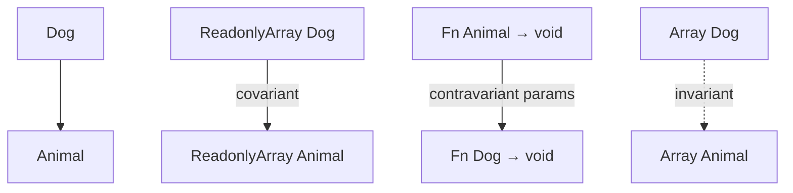

# Variance

Variance describes how type constructors (`Array<T>`, `Promise<T>`, function types) relate when their type arguments relate. Interviews use this to explain why `listDog` isn’t always a `listAnimal`, and why callback parameter types flip direction.

Related: [Generics](/typescript/02-generics) · [Structural Typing](/typescript/08-structural-typing) · [Type System](/typescript/01-type-system)

## Vocabulary

Assume `Dog extends Animal` (structurally: Dog assignable to Animal).

| Variance | Meaning | Example intuition |
| --- | --- | --- |
| Covariant | `F<Dog>` → `F<Animal>` | Read-only producers |
| Contravariant | `F<Animal>` → `F<Dog>` | Write-only consumers / function params |
| Invariant | neither | Mutable arrays |
| Bivariant | both (unsound) | Old method params |



## Functions

```ts
type Animal = { tag: 'animal' }
type Dog = Animal & { bark(): void }

type Fn<T> = (x: T) => void

// Under strictFunctionTypes:
// let fa: Fn<Animal> = (a) => {}
// let fd: Fn<Dog> = fa // OK — can pass Dog where Animal expected
// fa = fd // error — fd might call bark

type Ret<T> = () => T
// let ra: Ret<Animal> = () => ({ tag: 'animal' })
// let rd: Ret<Dog> = () => ({ tag: 'animal', bark() {} })
// ra = rd // OK — covariant returns
```

**Rule of thumb:** inputs contravariant, outputs covariant. “Consumer vs producer.”

## The method bivariance hole

```ts
interface Comparer<T> {
  compare(a: T, b: T): number // method syntax — bivariant check historically
}

interface ComparerStrict<T> {
  compare: (a: T, b: T) => number // function prop — strictFunctionTypes applies
}
```

`strictFunctionTypes` makes **function** property/param checking stricter; **method** syntax remains bivariant for React-like event handler DX / DOM typings. Interviewers love this nuance.

## Arrays & mutability

```ts
let dogs: Dog[] = []
// let animals: Animal[] = dogs // unsound if allowed — push Cat
let animalsRo: ReadonlyArray<Animal> = dogs // OK — covariant readonly
```

Mutable `T[]` is treated invariantly for assignability of the array type itself (simplified). Prefer `readonly T[]` for covariance.

## Explicit variance annotations (TS 4.7+)

```ts
interface Producer<out T> {
  get(): T
}
interface Consumer<in T> {
  set(value: T): void
}
interface Box<in out T> {
  get(): T
  set(value: T): void
}
```

`out` = covariant, `in` = contravariant, `in out` = invariant. Help measure correctness of generic interfaces; used in `.d.ts` for clarity.

## Promise / Observable intuition

`Promise<Dog>` assignable to `Promise<Animal>` (covariant in success type). RxJS `Observable` covariant in `T`. `Subject<T>` often invariant because it’s both push and pull.

## React mental link

```ts
// Roughly: props are input-like
// Component that accepts AnimalProps cannot always accept Dog-only props callbacks unsafely
type Props<T> = {
  value: T
  onChange: (value: T) => void // contravariant in T via onChange
}
```

See [React](/react/03-hooks) — event handler typing often relies on bivariant methods in React types.

## Interview Questions

**Q1. Why isn’t `Array<Dog>` an `Array<Animal>`?**  
Mutation soundness: you’d insert a non-Dog. Readonly arrays can be covariant.

**Q2. Why are function parameters contravariant?**  
A function that handles all Animals can handle Dogs; a Dog-only handler can’t accept a Cat passed as Animal.

**Q3. What does `strictFunctionTypes` change?**  
Enables correct contravariance for function types written as properties; methods stay bivariant.

**Q4. Read `interface Foo<out T>`.**  
`T` appears only in covariant (output) positions; `Foo<Dog>` assignable to `Foo<Animal>`.

**Q5. Is TypeScript’s variance sound?**  
Mostly better with strict flags; still pragmatic holes (bivariant methods, `any`, assertions).

## Common Mistakes

- Assuming generics are always covariant (Java arrays mistake).
- Marking mutable containers `out T`.
- Ignoring callback direction when designing APIs.
- Confusing inheritance with variance of type constructors.
- Using method syntax accidentally when you wanted strict checks.

## Trade-offs

| Choice | Pros | Cons |
| --- | --- | --- |
| Invariant mutable collections | Safe | Less flexible assignability |
| Covariant readonly views | Safe sharing | Need to freeze API surface |
| Bivariant methods | DOM/React ergonomics | Unsound edge cases |
| Variance annotations | Self-documenting | Extra syntax; errors if wrong |

**Senior takeaway:** Draw the **Dog/Animal** diagram once, label **read vs write**, and connect it to `ReadonlyArray` and `strictFunctionTypes`.

## Deep dive — positions in a type

| Position | Example | Variance |
| --- | --- | --- |
| Property value (readonly) | `{ readonly x: T }` | Covariant |
| Property value (mutable) | `{ x: T }` | Invariant-ish |
| Function return | `() => T` | Covariant |
| Function param | `(x: T) => void` | Contravariant |
| Array element mutable | `T[]` | Invariant |

## Deep dive — unsoundness demo

```ts
// If Array were covariant (it's not for mutable arrays):
// const dogs: Dog[] = [dog]
// const animals: Animal[] = dogs
// animals.push(cat) // runtime Dog[] has Cat — boom
```

## Deep dive — comparing to Kotlin/Java/Scala

Java arrays are covariant and unsound; generics invariant. Scala has `+T`/`-T`. TS added `in`/`out` annotations later; default inference of variance from usage with checking.

## Extra Q&A

**Q6. Is `Map<K,V>` invariant?**  
Mutable map — treat as invariant in both; readonly views differ.

**Q7. Event handler bivariance why?**  
DOM typings historically; React follows for DX.

**Q8. `Comparer<T>` method vs property?**  
Method bivariant; property function strict under `strictFunctionTypes`.

**Q9. Covariant return overrides?**  
TS supports return-type substitutability structurally for methods carefully.

**Q10. Practical API design tip?**  
Split read (`get`) and write (`set`) interfaces to recover variance — producer/consumer.


## Worked example — fixing a handler type

```ts
type OnChange<T> = (value: T) => void
// Parent wants OnChange<Animal>, child provides OnChange<Dog> — reject under strictFunctionTypes
// Provide OnChange<Animal> that handles all animals, or generic component
```

## API design rule

Expose `readonly T[]` / `ReadonlyArray<T>` when returning collections; accept `Iterable<T>` or `readonly T[]` when reading input — recovers covariance.

## Glossary

| Term | Definition |
| --- | --- |
| Covariant | Preserves direction |
| Contravariant | Reverses direction |
| Invariant | Neither |
| Bivariant | Both (unsound) |
| `in`/`out` | Variance annotations |


## Readonly vs mutable matrix

| Type | Dog → Animal |
| --- | --- |
| `ReadonlyArray<Dog>` → `ReadonlyArray<Animal>` | OK |
| `Array<Dog>` → `Array<Animal>` | Error |
| `() => Dog` → `() => Animal` | OK |
| `(a: Animal) => void` → `(a: Dog) => void` | OK |
| `(a: Dog) => void` → `(a: Animal) => void` | Error |
