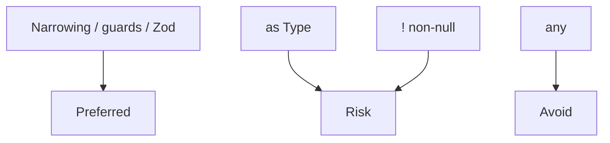

# Common Pitfalls

High-frequency TypeScript footguns in interviews and production. Each item: **symptom → why → fix**.

Related: [Type System](/typescript/01-type-system) · [Module Resolution](/typescript/07-module-resolution) · [Structural Typing](/typescript/08-structural-typing) · [JS Errors](/javascript/18-errors)

## 1. `any` infection

```ts
function f(x: any) {
  return x.getName() // no check
}
const n: number = f(1) // OK — any flows
```

**Fix:** `unknown` + narrow; eslint `@typescript-eslint/no-explicit-any`; tighten DT boundaries.

## 2. Non-null assertion addiction

```ts
el!.textContent = 'x' // crashes if null
```

**Fix:** early return, optional chaining, narrow. Reserve `!` for invariants proven elsewhere.

## 3. `as` lying

```ts
const u = JSON.parse(str) as User // unchecked
```

**Fix:** Zod/`io-ts`/valibot parse; or type guards. Assertions don’t validate ([Security](/browser/06-security) for API trust).

## 4. Enum pitfalls

```ts
enum E { A, B }
// emits runtime; number enums reverse-map; const enum breaks isolatedModules
```

**Fix:** `as const` object + type:

```ts
const E = { A: 'A', B: 'B' } as const
type E = (typeof E)[keyof typeof E]
```

## 5. `!` on optional props vs `exactOptionalPropertyTypes`

```ts
type T = { a?: string }
// With exactOptionalPropertyTypes, { a: undefined } may not assign to T
```

**Fix:** know the flag; distinguish missing vs undefined.

## 6. Array methods and `noUncheckedIndexedAccess`

```ts
const xs = [1, 2]
const x = xs[0] // number | undefined
```

**Fix:** narrow, or non-null after length check; prefer `.at` with care.

## 7. Over-narrowing with assignments

```ts
let x = Math.random() > 0.5 ? 1 : 'a'
x = 2 // still string | number
```

**Fix:** explicit annotate when you want a wider binding.

## 8. Function overload order

```ts
function f(x: string): string
function f(x: number): number
function f(x: string | number) {
  return x
}
// Specific overloads first; implementation is invisible to callers
```

## 9. Discriminant not literal

```ts
type Bad = { type: string; a: number } | { type: string; b: boolean }
// won't narrow on type === 'a'
type Good = { type: 'a'; a: number } | { type: 'b'; b: boolean }
```

## 10. Promise misuse typed away

```ts
async function g() {
  return 1
}
const p: Promise<number> = g()
// forgetting await — still typechecks if you annotate wrong
```

**Fix:** `no-floating-promises` lint; `void` for fire-and-forget intentional.

## 11. `Object.keys` typing

```ts
const o = { a: 1, b: 2 }
Object.keys(o).forEach((k) => {
  // k is string — not 'a'|'b'
  // o[k] error under strict
})
```

**Fix:** `(Object.keys(o) as (keyof typeof o)[])` carefully, or iterate `Object.entries`, or generic helpers acknowledging excess props.

## 12. Variance / callback bugs

See [Variance](/typescript/09-variance) — mutating covariant collections, unsound event handlers.

## 13. Path alias runtime miss

`paths` in tsconfig ≠ Node resolution. → [Module Resolution](/typescript/07-module-resolution)

## 14. React `useState` null init

```ts
const [el, setEl] = useState<HTMLElement | null>(null)
```

Without generic, inference collapses poorly. → [React Hooks](/react/03-hooks)

## 15. `typeof` array vs tuple

```ts
const t = [1, 'a'] // (string|number)[]
const u = [1, 'a'] as const // readonly [1, 'a']
```

## Diagram: escape hatches ranked



## Interview Questions

**Q1. Top three TS bugs you’ve seen?**  
Pick from: false assertions on JSON, `any` in shared libs, enum/module emit mismatches, optional indexing crashes.

**Q2. How do you type `JSON.parse`?**  
Return `unknown`, validate.

**Q3. Why is `enum` controversial?**  
Runtime emit, tree-shaking, numeric enum quirks, `isolatedModules` + const enum.

**Q4. Fix `Object.keys` iteration typing?**  
Explain structural openness: objects may have more keys; TS types `string`.

**Q5. What eslint rules matter most?**  
`no-explicit-any`, `no-floating-promises`, `strict-boolean-expressions` (careful), `consistent-type-imports`.

## Common Mistakes (meta)

- Silencing errors instead of modeling unions.
- Believing types enforce runtime security.
- Mixing CJS/ESM configs until `tsc` + bundler diverge.
- Deep recursive types for one-off problems.
- Annotating everywhere — fighting inference.

## Trade-offs

| Escape | When acceptable | Cost |
| --- | --- | --- |
| `unknown` + guard | Boundaries | Verbosity |
| Zod | External data | Bundle |
| `as` | Proven invariant | Lie risk |
| `any` | Throwaway scripts | Infection |
| Loosen `tsconfig` | Legacy migrate | Safety debt |

**Senior takeaway:** Pitfalls answers should include **a concrete fix and a lint/tsconfig guard** so the bug can’t recur silently.

## Deep dive — `tsconfig` checklist for apps

```json
{
  "compilerOptions": {
    "strict": true,
    "noUncheckedIndexedAccess": true,
    "exactOptionalPropertyTypes": true,
    "noImplicitOverride": true,
    "verbatimModuleSyntax": true,
    "moduleResolution": "Bundler",
    "skipLibCheck": true
  }
}
```

Enable gradually in legacy codebases — each flag surfaces new errors ([Type system](/typescript/01-type-system)).

## Deep dive — assertion functions misuse

```ts
function assertString(x: unknown): asserts x is string {
  // forgot to throw — TS still narrows! unsound
  if (typeof x !== 'string') console.error('bad')
}
```

Assertion functions must actually throw/abort.

## Deep dive — React Query / Zod boundary

Infer types from Zod schemas as single source of truth for API payloads — avoids `as User` drift ([React Query](/react/06-react-query)).

## Extra Q&A

**Q6. `// @ts-ignore` vs `@ts-expect-error`?**  
Prefer expect-error — fails if no error (stale suppressions).

**Q7. Why `key` as `string` breaks `Record` access?**  
Need `keyof` constrained keys.

**Q8. Numeric enum compare?**  
Number enums are loose with numbers — prefer string enums/`as const`.

**Q9. `declare module` without types?**  
Silences missing module — hides real issues.

**Q10. Slow IDE?**  
Huge unions, deep recursion, many path mappings — simplify types; project references.


## Worked example — production incident

`as User` on API JSON → missing field → runtime crash. Postmortem: Zod parse at boundary, `unknown` fetch wrapper, Sentry on parse errors. Types don’t replace validation.

## Lint set (recommended)

- `@typescript-eslint/no-explicit-any`
- `@typescript-eslint/no-floating-promises`
- `@typescript-eslint/consistent-type-imports`
- `@typescript-eslint/no-misused-promises`
- `no-only-tests` (CI)

## Glossary

| Term | Definition |
| --- | --- |
| Infection | `any` propagating |
| Escape hatch | `as` / `any` / `!` |
| Boundary | I/O edge of the program |
| Exhaustiveness | `never` check in switches |


## Migration strategy off `any`

1. Enable `noImplicitAny`.  
2. Replace public `any` with `unknown`.  
3. Add Zod at IO.  
4. Tighten generics.  
5. Turn on `noUncheckedIndexedAccess` last (noisy).

Track error counts in CI to prevent regressions.
