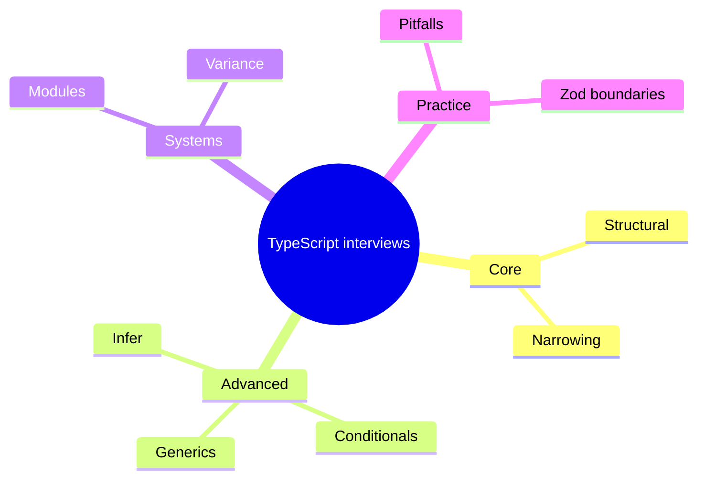

# TypeScript Advanced Interview Q&A

Drill set for mid→senior FE/full-stack interviews. Cross-links go to deep chapters; answer out loud in 60–90s then check.

Related: [Browser Q&A](/browser/10-interview-qa) · [React Q&A](/react/12-interview-qa) · [JS Senior Q&A](/javascript/24-senior-js-qa)



## Interview Questions

### Type system core

**Q1. What erases at compile time?**  
Almost all type syntax. Exceptions: `enum`, `namespace` emit, `experimentalDecorators` metadata (legacy), `import` values. → [Type System](/typescript/01-type-system)

**Q2. `unknown` vs `any` vs `never`?**  
Safe top / unsafe opt-out / bottom empty set.

**Q3. Structural typing in one sentence?**  
Compatibility by shape, not by name — with freshness and private/brand escapes. → [Structural](/typescript/08-structural-typing)

**Q4. Excess property check?**  
Only on fresh literals assigned to a type — typo catcher.

**Q5. Is TS sound?**  
No — pragmatic. Name holes: `any`, assertions, bivariant methods.

## Generics & inference

**Q6. When explicit type args?**  
No inference context (`useRef(null)`, empty collections).

**Q7. `K extends keyof T` purpose?**  
Correlate key with `T[K]`. → [Generics](/typescript/02-generics)

**Q8. Generics runtime?**  
Erased — pass constructors/tokens as values if needed.

**Q9. Default type parameters?**  
`type Foo<T = string>` when omitted.

**Q10. Infer vs type param?**  
`infer` binds inside conditional pattern match. → [Infer](/typescript/04-infer)

## Conditionals & utilities

**Q11. Distributive conditional?**  
Naked `T` in `T extends U ? X : Y` maps over union members. → [Conditionals](/typescript/03-conditional-types)

**Q12. Prevent distribution?**  
`[T] extends [U] ? ...`

**Q13. Implement `Exclude` / `Omit`.**  
`T extends U ? never : T`; `Pick<T, Exclude<keyof T, K>>`. → [Utilities](/typescript/05-utility-types)

**Q14. Shallow `Partial`?**  
Only top-level keys optional.

**Q15. Key remapping?**  
`as` clause in mapped types; `never` drops keys.

## Infer patterns

**Q16. `ReturnType` / `Parameters`.**  
Show `infer R` / `infer P` implementations.

**Q17. Unwrap `Promise`.**  
`Awaited<T>` or nested `infer`.

**Q18. Template literal routes.**  
`` T extends `${string}:${infer P}` `` unions param names.

**Q19. Same `infer U` twice?**  
Becomes union of candidates (covariant positions).

**Q20. `infer U extends Constraint`?**  
Fail match if constraint not satisfied (TS 4.7+).

## Merging & modules

**Q21. Why interfaces for lib objects?**  
Augmentation / merging. Types don’t merge. → [Merging](/typescript/06-declaration-merging)

**Q22. Express `req.user` typing?**  
Module augmentation.

**Q23. `moduleResolution: bundler` vs `nodenext`?**  
App bundlers vs Node ESM correctness. → [Modules](/typescript/07-module-resolution)

**Q24. `paths` gotcha?**  
TS-only unless mirrored by runtime/bundler.

**Q25. `import type` why?**  
Guarantees erase; needed with `verbatimModuleSyntax` / `isolatedModules`.

## Variance

**Q26. Why not `Dog[]` as `Animal[]`?**  
Write would break type safety. → [Variance](/typescript/09-variance)

**Q27. Function param direction?**  
Contravariant — handlers of animals accept dogs.

**Q28. `strictFunctionTypes`?**  
Strict function property checking; methods bivariant.

**Q29. `ReadonlyArray` covariance?**  
Yes — producer-only.

**Q30. `in` / `out` annotations?**  
Declare contravariant / covariant type params.

## Pitfalls & practice

**Q31. Type `JSON.parse`?**  
`unknown` + validate (Zod). → [Pitfalls](/typescript/10-pitfalls)

**Q32. Prefer `as const` over enum?**  
Erasable, tree-shakeable, simpler ESM.

**Q33. `Object.keys` returns `string[]` why?**  
Objects may have more keys than the type admits (structural).

**Q34. Floating promises?**  
Enable lint; types won’t catch unhandled rejections alone.

**Q35. `satisfies` vs `as`?**  
`satisfies` checks without widening away literals; `as` forces.

## Architecture / FE scenarios

**Q36. Type a heterogeneous form field map?**  
Discriminated union per field type; `Record` loses correlation — use mapped types over field config.

**Q37. API client typing strategy?**  
OpenAPI codegen **or** Zod schemas shared; avoid unchecked `as Resp`.

**Q38. Component generic list?**  
`function List<T>(props: { items: T[]; render: (i: T) => ReactNode })` — [React](/react/03-hooks)

**Q39. Narrowing in ` Dom` event handlers?**  
`e.currentTarget` typed from listener; `e.target` often wider — don’t confuse.

**Q40. Monorepo types shared FE/BE?**  
Shared package of Zod/types; project references; don’t import server code into client bundles ([Next](/nextjs/02-rsc)).

## Whiteboard challenges (do live)

**C1.** Write `DeepReadonly<T>`.  
**C2.** Write `MyPick` / `MyOmit`.  
**C3.** Extract route params from `` `/users/:id` ``.  
**C4.** Brand `UserId` vs `OrderId`.  
**C5.** Show distributive vs non-distributive `ToArray`.  
**C6.** Explain why this fails and fix:

```ts
function head<T>(arr: T[]): T {
  return arr[0] // error with noUncheckedIndexedAccess
}
```

## Rapid definitions

| Term | One-liner |
| --- | --- |
| Widening | Literal → general (`'a'` → `string`) |
| Freshness | Excess property check on literals |
| Naked type param | Distributes in conditionals |
| Ambient | `declare` without emit |
| Opaque/branded type | Structural string + phantom brand |
| Variance | How `F<T>` changes as `T` changes |
| Assignability | Can value of S be used as T |
| `satisfies` | Validate type keep inference |
| `isolatedModules` | Per-file transpile safe |
| Dual package hazard | CJS/ESM wrong import interop |

## Common Mistakes (interview delivery)

- Reciting utility names without implementing one.
- Saying “TS is nominal like Java.”
- Claiming types secure the browser ([XSS](/browser/06-security) still applies).
- Ignoring `strict` flag differences when answering nullability.
- Overlong monologues — structure: definition → example → pitfall → trade-off.

## Trade-offs (close every senior answer)

> “I’d model this as X (union/generic/zod) because it preserves Y invariant; cost is Z complexity/compile time; validation at the boundary keeps runtime honest.”

That framing beats trivia.

## More whiteboard prompts

**C7.** Implement `DeepPartial<T>` with function exclusion.  
**C8.** Type `Object.entries` better for a known object type (and explain unsoundness).  
**C9.** Write a `XOR<A,B>` exclusive props helper.  
**C10.** Extract `prop` names that are functions from a type.  
**C11.** Show `strictFunctionTypes` breaking a bivariant callback assignment.  
**C12.** Package.json `exports` with `types` for a dual ESM package.

```ts
// C9 sketch
type Without<T, U> = { [P in Exclude<keyof T, keyof U>]?: never }
type XOR<T, U> = T | U extends object
  ? (Without<T, U> & U) | (Without<U, T> & T)
  : T | U
```

## Cross-domain FE questions

**Q41. Type a `fetch` wrapper with schema?**  
`async function get<T>(url: string, schema: ZodType<T>): Promise<T>` — parse response.

**Q42. Next.js `params` typing?**  
Infer from route segment helpers / await `params` promise in newer Next — [App Router](/nextjs/01-app-router).

**Q43. CSS modules class names?**  
`declare module '*.module.css'` — [Merging](/typescript/06-declaration-merging).

**Q44. Worker message protocol?**  
Discriminated union + `satisfies` on send side; narrow on receive.

**Q45. Why not `enum` in Vite libs?**  
Preserve erasability + `isolatedModules` friendliness — [Pitfalls](/typescript/10-pitfalls).

## Scoring rubric (self-check)

| Level | Signal |
| --- | --- |
| Junior | Lists utilities, uses `any` |
| Mid | Narrowing, generics, `Pick`/`Omit` |
| Senior | Distribution, variance, module resolution, boundary validation |
| Staff | API design trade-offs, monorepo types, soundness holes named honestly |

## Final 10 lightning

**Q46.** `satisfies` preserves literals — yes.  
**Q47.** `any` assignable both ways — yes.  
**Q48.** `never` in unions vanishes — yes.  
**Q49.** `interface` merges — yes; `type` no.  
**Q50.** Mutable arrays covariant — no.  
**Q51.** `paths` rewrite Node — no.  
**Q52.** `JSON.parse` → `unknown` — yes.  
**Q53.** Brands runtime-enforce — no.  
**Q54.** `infer` only in conditionals — yes.  
**Q55.** `ReadonlyArray` covariant — yes.


## Study plan (TypeScript track)

Hours 1–2: type system + structural + pitfalls. Hours 3–4: generics + conditionals + infer utilities on whiteboard. Hour 5: variance + modules. Hour 6: Q&A lightning + Zod boundary story.

## Pair chapters

| Topic | Link |
| --- | --- |
| Erasure / JS runtime | [JS fundamentals](/javascript/01-fundamentals) |
| Async types | [JS async](/javascript/11-async) |
| React components | [React hooks](/react/03-hooks) |
| Browser fetch typing | [Networking](/browser/05-networking) |

## One-minute closing speech

“TypeScript is a structural, gradual, erasable system. I use narrowing and discriminated unions daily, generics to preserve relationships, conditionals/infer for library types, and runtime validation at boundaries because types aren’t sound and aren’t a security boundary.”


## Mock interview script (30 min)

1. Explain structural typing + freshness (3 min).  
2. Implement `Omit` / `Exclude` (5).  
3. Distributive conditional puzzle (5).  
4. Variance Dog/Animal (5).  
5. Module resolution Vite vs Node (5).  
6. XSS vs types — why Zod (3).  
7. Lightning definitions (4).

Grade yourself against the rubric in this chapter.
